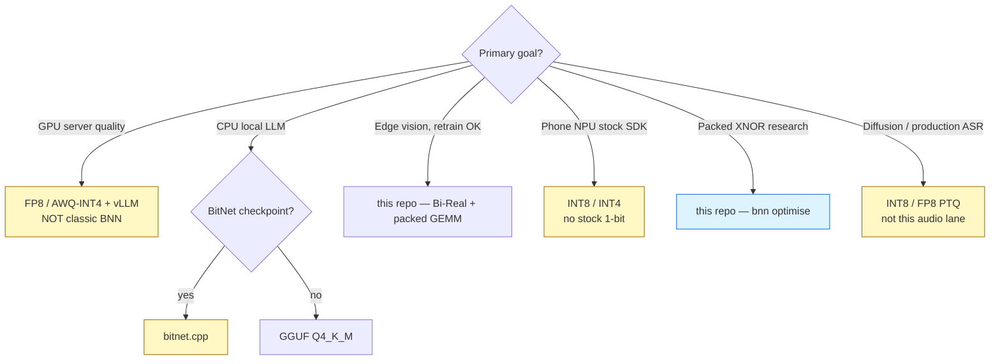
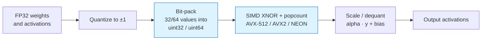
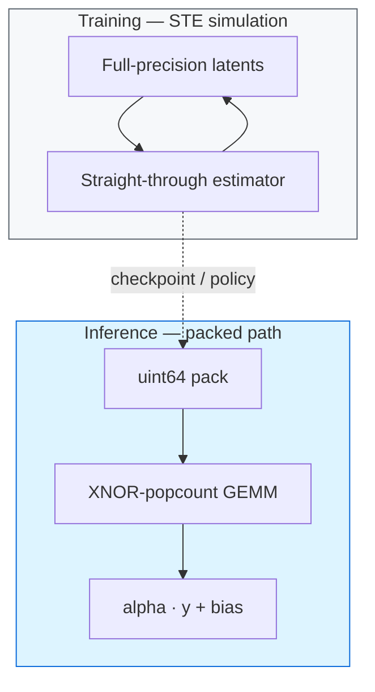
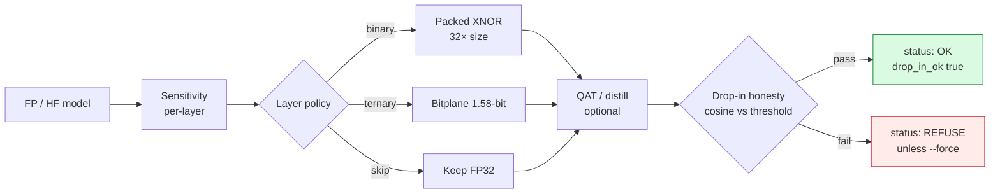
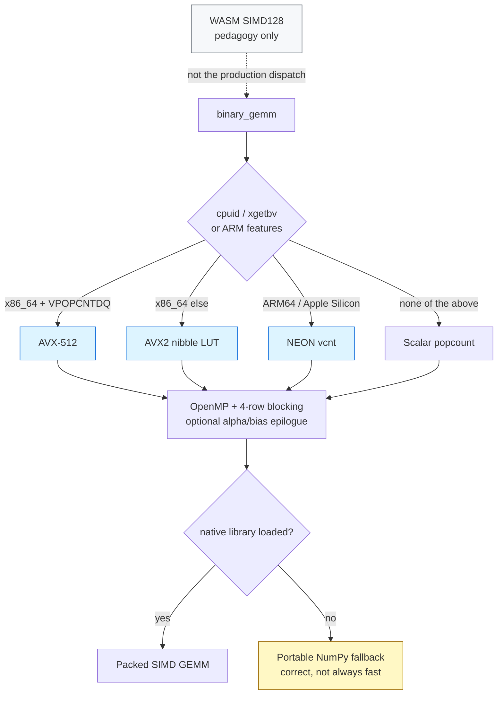
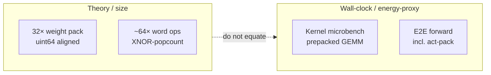
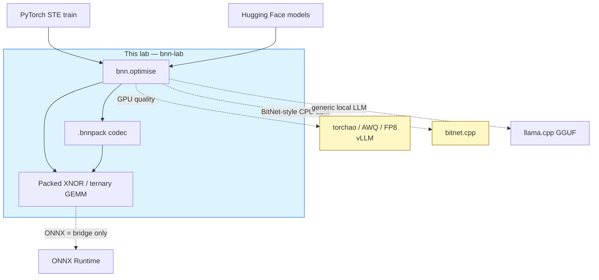
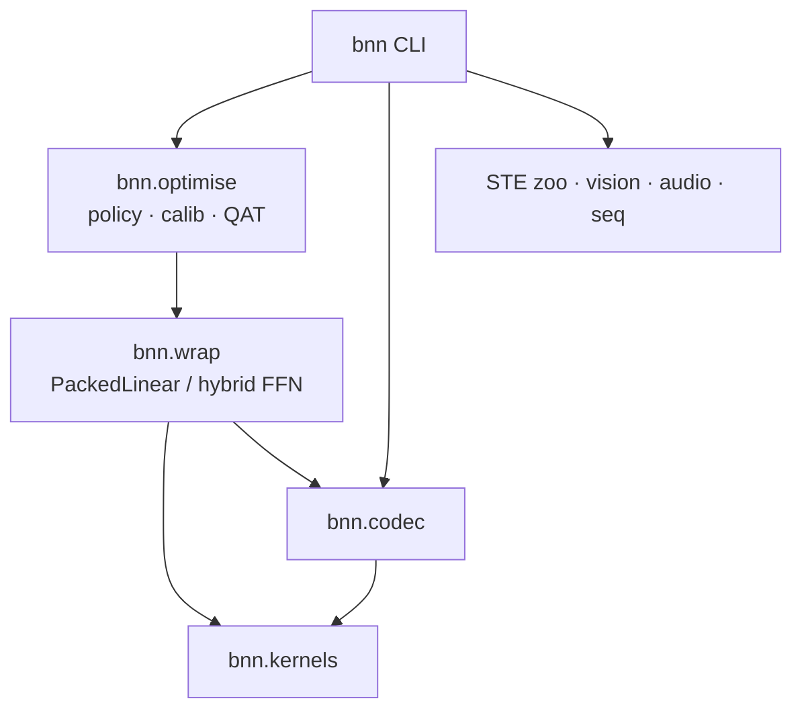

# Binary Neural Networks

### Packed 1-bit inference for CPU and edge — with metrics that refuse to lie

[](https://github.com/KanakMalpani/Binary-Neural-Networks/actions/workflows/ci.yml)
[](https://github.com/KanakMalpani/Binary-Neural-Networks/actions/workflows/codeql.yml)
[](https://scorecard.dev/viewer/?uri=github.com/KanakMalpani/Binary-Neural-Networks)
[](https://kanakmalpani.github.io/Binary-Neural-Networks/)
[](docs/COMPATIBILITY_MATRIX.md)
[](LICENSE)
[](REPRODUCIBILITY.md)
[](#dual-metric-benchmarks)
[](#dual-metric-benchmarks)
[](https://github.com/KanakMalpani/Binary-Neural-Networks/blob/main/docs/PYPI_PUBLISH.md)

**Binary Neural Networks** (`bnn` 1.0.0) is the honest optimiser toolkit for **packed binary / ternary** inference on **CPU and edge**. It bit-packs weights into `uint64`, runs **real** XNOR–popcount SIMD kernels, and prints **dual metrics** — pack math and wall-clock — as separate numbers.

It is **not** a claim that `sign()` is 32× faster on GPU. Compression **32×** is exact uint64 pack **size**. Kernel speed is XNOR–popcount. Those are different physics.

<table>
<tr>
<td width="16%" align="center">

### 32.00×
**weight pack**<br/>
<sub>exact, uint64-aligned</sub>

</td>
<td width="16%" align="center">

### ~23.9×
**SIMD vs NumPy FP32**<br/>
<sub>64×4096×4096, one CPU</sub>

</td>
<td width="16%" align="center">

### err = 0
**every ISA path**<br/>
<sub>AVX-512 · AVX2 · NEON · scalar</sub>

</td>
<td width="16%" align="center">

### 5.1×
**faster kernel**<br/>
<sub>aggregate, 12 shapes</sub>

</td>
<td width="16%" align="center">

### 29.68×
**measured RAM**<br/>
<sub>not the 32× brochure</sub>

</td>
<td width="16%" align="center">

### REFUSE
**when cosine is junk**<br/>
<sub>drop-in is a gate, not a vibe</sub>

</td>
</tr>
</table>

> Six numbers, six kinds of claim — that distinction *is* the product.
> Pack ratio is exact math. `err = 0` is exact integer arithmetic. SIMD and kernel
> speedups are wall-clock on one machine. Resident RAM is measured from real
> buffers, which is why it sits **below** theoretical 32×. `REFUSE` is the report
> telling you not to ship a wrap whose cosine collapsed.

**Jump:** [60 seconds](#60-seconds-to-a-dual-metric-report) · [When to use / when not](#when-to-use--when-not) · [Kernel](#core-kernel-pipeline) · [Wrap](#wrap--optimisation-flow) · [SIMD](#simd-execution-ladder) · [Benchmarks](#dual-metric-benchmarks) · [Bridges](#ecosystem--bridges) · [Docs](https://kanakmalpani.github.io/Binary-Neural-Networks/)

---

## 60 seconds to a dual-metric report

PyPI **`bnn-lab` is not live yet** (human [Trusted Publisher](docs/PYPI_PUBLISH.md) residual). Until that upload, install from Git. The short name `bnn` on PyPI is an unrelated package — import and CLI here stay `bnn`.

```bat
pip install "bnn-lab @ git+https://github.com/KanakMalpani/Binary-Neural-Networks.git@v1.0.0"
bnn repro
bnn optimise --policy auto --report results\optimise_report.json
```

```python
from bnn.optimise import OptimiseConfig, optimise_model

result = optimise_model(model, calib_inputs, OptimiseConfig(policy="auto"))
print(result.payload["compression_replaced_weights"])  # 32× pack — size, not latency
print(result.payload["status"])                        # OK or REFUSE_DROP_IN_CLAIM
```

Expect **`REPRO: PASS`** (exit 0). The report prints **compression**, **cosine**, **wall-clock**, and **REFUSE/OK**. Prefer **`bnn optimise`** over legacy `bnn wrap --ultra`.

Dev clone (extras + constraints; optional native compile):

```bat
git clone https://github.com/KanakMalpani/Binary-Neural-Networks.git
cd Binary-Neural-Networks
pip install -e ".[dev]" -c constraints.txt
python -m bnn.kernels.compile_native
bnn repro
```

No compiler? Install still succeeds — the NumPy packed path stays **correct**. Windows native needs **MSVC x64** (MinGW 32-bit → WinError 193). Full path: [`docs/GUIDE_E2E.md`](docs/GUIDE_E2E.md).

---

## The thesis (locked)

Most “binary” demos train with STE, then infer with `sign()` + `nn.Linear`. That is a **simulation**. On commodity GPUs it is often *slower* than FP32. The 32× in papers is usually **bit-pack compression**, not end-to-end latency.

| Locked claim | Meaning |
|--------------|---------|
| Speedups come from **packed kernels** | XNOR + popcount on CPU/edge — not `sign()` theatre |
| Training STE ≠ inference throughput | STE trains latents; inference uses pack + GEMM |
| Compression **32×** | Exact for aligned uint64 binary pack — **size**, not e2e latency |
| Commodity GPU quality | INT4 / FP8 / AWQ / vLLM — documented bridges, not fake BNN wins |
| Repro culture | `bnn repro` + [`tests/golden_floors.json`](tests/golden_floors.json) + committed [`results/*.json`](results/) |

---

## When to use / when **not**

Honesty is the product. If another stack wins, this lab **says so** and routes you there (`bnn recommend`). Compact callout under the thesis — not a table buried at the bottom.

<table>
<tr>
<td width="50%" valign="top">

**Use this lab when**

- You want **smaller weights on CPU / edge** and will retrain or wrap wide GEMMs
- You need **real XNOR–popcount**, not `sign()` + `nn.Linear`
- You want a report that **refuses drop-in** when cosine is junk
- You are researching packed binary / ternary kernels, Bi-Real-style vision, or `.bnnpack`
- You want **dual metrics**: 32× pack **and** measured wall-clock, separately

</td>
<td width="50%" valign="top">

**Do not use this lab when**

- **GPU server quality** → FP8 / AWQ-INT4 + vLLM — **not** `sign()`, **not** “GPU 32×”
- **Local CPU LLM chat** → [bitnet.cpp](https://github.com/microsoft/BitNet) (BitNet) or GGUF Q4_K_M
- **Phone / NPU stock SDK** → INT8 / INT4 — vendors do **not** ship native 1-bit
- **Production ASR / diffusion fidelity** → INT8 Whisper / ORT / FP8 PTQ (audio here is synthetic)
- You need to claim **32× e2e latency** from pack math alone — forbidden forever

</td>
</tr>
</table>



```bat
bnn recommend --goal edge-vision
```

Also skip (or hybrid-skip) **small GEMMs / attention projections** (packing overhead wins; auto leaves them FP) and **drop-in HF LLMs without QAT** (cold binary PTQ cosine often collapses — the report REFUSEs unless `--force`).

Full tree: [`docs/GUIDE_E2E.md`](docs/GUIDE_E2E.md) · [`docs/18_DECISION_TREE_AND_COMPLETE_ROADMAP.md`](docs/18_DECISION_TREE_AND_COMPLETE_ROADMAP.md) · limits: [`MODEL_CARD.md`](MODEL_CARD.md).

---

## Core kernel pipeline

FP32 tensors are not “made binary” by `sign()` in `nn.Linear`. Inference **quantizes to ±1**, **packs 32 or 64 values into a `uint32`/`uint64` word**, then a SIMD kernel does **XNOR + popcount** and **scales** back. That pack is the **32×**. The popcount is the **speed**.





---

## Wrap & optimisation flow

`bnn optimise` does not blindly binarize every `Linear`. It **measures**, **assigns a per-layer policy**, optionally **QAT/distills**, then **refuses drop-in** when cosine is below the gate.



Default `--policy auto` on the documented hybrid demo lands **cosine ~0.70** and **REFUSE_DROP_IN** — that is working as designed, not a silent 32× quality claim. Ternary+QAT can reach cosine **0.991** and still **lose** wall-clock (e2e **0.73×**). The product gap is hybrid/binary that is **both** drop-in **and** faster — not paperwork.

Layer search is monotonic and tested: **32× is available at cosine 0.27.** That is why the search exists.

| `quality_floor` | final cosine | theoretical compression | assignment |
|---|---|---|---|
| 0.00 | 0.271 | **32.0×** | 3 binary |
| 0.90 | 0.950 | 1.71× | 1 ternary, 2 skip |
| 0.999 | 1.000 | 1.00× | 3 skip |

Details: [`docs/42_QAT_AND_LAYER_SEARCH.md`](docs/42_QAT_AND_LAYER_SEARCH.md) · tutorial [`07`](docs/tutorials/07_OPTIMISER_QUICKSTART.md).

---

## SIMD execution ladder

One C source. ISA is chosen at **run** time — never `-march=native` baking the builder’s CPU into a wheel. AVX-512 is used when present, **never required**. **WASM SIMD128** is a **pedagogy** path (`wasm/`), not a substitute for the native kernel.



| Platform | Native | Production ladder |
|----------|--------|-------------------|
| Linux x86-64 (GCC/Clang) | yes | AVX-512 → AVX2 → scalar |
| Windows x64 (MSVC) | yes | AVX-512 → AVX2 → scalar |
| macOS / Linux arm64 | yes | NEON |
| macOS x86-64 | yes | AVX2 → scalar |
| Browser / teaching | WASM SIMD128 | pedagogy — [`wasm/`](wasm/) |
| Anything else | NumPy packed GEMM | correctness first |

Deep dive: [`docs/41_PORTABLE_SIMD_KERNEL.md`](docs/41_PORTABLE_SIMD_KERNEL.md).

```bat
bnn validate-native          # selected ISA path, err = 0
BNN_KERNEL=scalar bnn bench  # force scalar / avx2 / avx512 / neon
```

---

## Dual-metric benchmarks

Never equate pack math with latency.



| Quantity | Kind | Do not claim as |
|----------|------|-----------------|
| Weight pack **32.00×** | Exact | End-to-end latency |
| Native GEMM **err = 0** | Exact (when native loaded) | Accuracy of a wrapped LLM |
| ISA paths agree | Exact | Cross-machine float identity |
| **~23.9×** vs NumPy FP32 at 64×4096×4096 | Wall-clock (machine-dependent) | Full-model FPS / GPU 32× |
| Wrap e2e speedup | Wall-clock (machine-dependent) | Drop-in quality |

Committed snapshot (CPU; [`results/SUMMARY.md`](results/SUMMARY.md)):

| Check | Result |
|-------|--------|
| Pack compression | **32.0×** (exact) |
| Native GEMM vs ±1 FP32 | **err = 0** |
| Every ISA path agrees bit-for-bit | **err = 0** (binary **and** ternary) |
| 64×4096×4096 compute vs NumPy FP32 | **~23.9×** (machine-dependent) |
| Wrapped Linear, measured RAM | **29.68×** (theoretical 32.00×) |
| MNIST binary / ternary | **96.36%** / **97.16%** (FP **97.67%**) |
| CIFAR Bi-Real vs FP CNN | **61.14%** vs **71.14%** (~10 pp) |
| Audio binary vs FP (synthetic tones) | **96.0%** vs **94.5%** — **not** production ASR |

<details>
<summary><b>Where the kernel speed came from</b> (before → after, same process, min-of-5)</summary>

The old kernel opened a **new OpenMP parallel region per batch row** and
re-streamed all of `W` `B` times. One team per call plus 4-row register blocking,
then runtime SIMD dispatch:

| Shape (B×N×M) | before | after | |
|---|---|---|---|
| 8 × 4096 × 4096 | 0.212 ms | 0.062 ms | 3.4× |
| 64 × 4096 × 4096 | 1.999 ms | 0.437 ms | 4.6× |
| 256 × 1024 × 1024 | 0.739 ms | 0.119 ms | 6.2× |
| 512 × 512 × 512 | 2.038 ms | 0.103 ms | **19.9×** |
| **aggregate, 12 shapes** | **10.74 ms** | **2.12 ms** | **5.1×** |

Tiny shapes are call-overhead bound and unchanged — as expected. Wall-clock moves
with core count, memory bandwidth and thermals; `err = 0` does not.
Details: [`docs/41_PORTABLE_SIMD_KERNEL.md`](docs/41_PORTABLE_SIMD_KERNEL.md).

</details>

> Floors live in [`tests/golden_floors.json`](tests/golden_floors.json). Wall-clock ratios move with CPU, threads, and OpenMP — gates check **conclusions**, not bit-identical floats.

---

## Ecosystem & bridges

This lab occupies **packed PyTorch BNN optimisation** now that **Larq (TF/Keras) is archived**. It does **not** compete with bitnet.cpp on LLM tok/s, or with torchao/vLLM on GPU INT4/FP8. When those win, `bnn bridge` / `bnn recommend` say so.





**Installing does not require a compiler.** `setup.py` builds the kernel when a toolchain is present and falls back to NumPy otherwise. Prebuilt wheels (Linux / macOS / Windows × x86-64 / arm64) ship via [`wheels.yml`](.github/workflows/wheels.yml). Live `pip install bnn-lab` from PyPI still needs [Trusted Publishing](docs/PYPI_PUBLISH.md).

---

## What you can run next

| Path | Command / entry | Docs |
|------|-----------------|------|
| Optimiser | `bnn optimise --policy auto` | [GUIDE §4](docs/GUIDE_E2E.md) · [tutorial 07](docs/tutorials/07_OPTIMISER_QUICKSTART.md) · [HF 08](docs/tutorials/08_HF_OPTIMISER.md) |
| **Per-layer search** | `bnn.wrap.search_layer_modes(...)` | [docs/42](docs/42_QAT_AND_LAYER_SEARCH.md) |
| **QAT recovery** | `bnn optimise --qat-steps 200` | [docs/42](docs/42_QAT_AND_LAYER_SEARCH.md) — search *before* QAT |
| **Memory footprint** | `bnn memory --dim 1024 --ff 4096` | [docs/43](docs/43_MEMORY_FOOTPRINT.md) |
| Codec | `bnn encode` / `bnn decode` | [GUIDE §5](docs/GUIDE_E2E.md) |
| MNIST STE | `bnn train --epochs 3 --seed 42` | pedagogy — not a throughput win |
| Vision | `bnn train-image --epochs 8 --subset 30000` | [tutorial 04](docs/tutorials/04_image_cifar.md) |
| Audio | `bnn train-audio --epochs 5` | [tutorial 05](docs/tutorials/05_audio.md) — synthetic only |
| Seq2seq / profile | `bnn train-seq2seq` · `bnn profile` | [tutorial 06](docs/tutorials/06_encoder_decoder.md) |

| Start here | |
|--|--|
| **Human path** | [`docs/GUIDE_E2E.md`](docs/GUIDE_E2E.md) — install → repro → optimise |
| **Browsable docs** | [GitHub Pages](https://kanakmalpani.github.io/Binary-Neural-Networks/) |
| **Reproduce** | [`REPRODUCIBILITY.md`](REPRODUCIBILITY.md) · `bnn repro` |
| **AI agents** | [`AGENTS.md`](AGENTS.md) |
| **Knowledge graph** | [`knowledge_graph/`](knowledge_graph/) · [`docs/44_KNOWLEDGE_GRAPH.md`](docs/44_KNOWLEDGE_GRAPH.md) |
| **Roadmap** | [`ROADMAP.md`](ROADMAP.md) |
| **Compatibility** | [`docs/COMPATIBILITY_MATRIX.md`](docs/COMPATIBILITY_MATRIX.md) |
| **Limits** | [`MODEL_CARD.md`](MODEL_CARD.md) |

```
bnn/           STE, layers, models, optimise, export, determinism
bnn/wrap/      hybrid policy, calib, QAT, PackedLinear
bnn/kernels/   portable XNOR GEMM (+ optional native)
bnn/codec/     .bnnpack encode / decode
bnn/vision/    CIFAR Bi-Real, tiny binary ViT
bnn/audio/     STFT + synthetic tones
bnn/seq/       binary Transformer encoder / decoder
results/       committed golden JSON + SUMMARY.md
tests/         pytest + golden_floors.json
```

Public API: `import bnn` — [`docs/api/README.md`](docs/api/README.md). CLI: `bnn --help` · `bnn --version`.

---

## Is / is not

| Is | Is not |
|----|--------|
| Honest CPU / edge proof of packed binary speedups | A promise of 32× e2e everywhere |
| Trainable BNN + BitLinear pedagogy + optimiser | Full BitNet LLM pretrain |
| Dual-metric culture and repro gates | Bit-identical floats across OS/CPU |
| Bridges toward INT4 / FP8 / bitnet.cpp | A cuDNN / TensorRT replacement |
| Tagged **v1.0.0** lab (PyPI upload still human) | A fake-binary GPU 32× story |

---

## Contributing & quality

- [`CONTRIBUTING.md`](CONTRIBUTING.md) · [`CHANGELOG.md`](CHANGELOG.md) · [`SECURITY.md`](SECURITY.md) · [`docs/LAUNCH_CHECKLIST.md`](docs/LAUNCH_CHECKLIST.md)
- Product direction: [`ROADMAP.md`](ROADMAP.md) (Phases A→F; workstreams W1–W14)
- API reference is **generated** from docstrings (`mkdocs build --strict` in CI) — see [`docs/api/`](docs/api/); a renamed symbol breaks the build rather than silently emptying a page
- Site: [kanakmalpani.github.io/Binary-Neural-Networks](https://kanakmalpani.github.io/Binary-Neural-Networks/)
- Supply chain: wheels + sdist carry signed [build provenance](https://docs.github.com/actions/security-guides/using-artifact-attestations) (`gh attestation verify`), and `pip-audit` is a **hard gate** on the shipped dependency set with every ignore triaged in [`ci.yml`](.github/workflows/ci.yml)
- Agents: [`AGENTS.md`](AGENTS.md) — do not invent alternate golden shapes
- CI: [`ci.yml`](.github/workflows/ci.yml) — quality (ruff/mypy/coverage ≥80%), Windows + Linux native (export-check, repro), **portability** (linux-arm64 NEON, macos-arm64 NEON, macos-x86_64) per [`COMPATIBILITY_MATRIX.md`](docs/COMPATIBILITY_MATRIX.md), Python 3.11–3.13; plus [CodeQL](.github/workflows/codeql.yml), [Scorecard](.github/workflows/scorecard.yml), [wheels](.github/workflows/wheels.yml)

```bat
bnn export-check
bnn validate-native
bnn bench
bnn eval-suite
```

---

**License:** [MIT](LICENSE) · **Citation:** [`CITATION.cff`](CITATION.cff) · **Repo:** [KanakMalpani/Binary-Neural-Networks](https://github.com/KanakMalpani/Binary-Neural-Networks)
