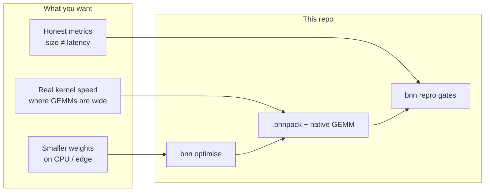
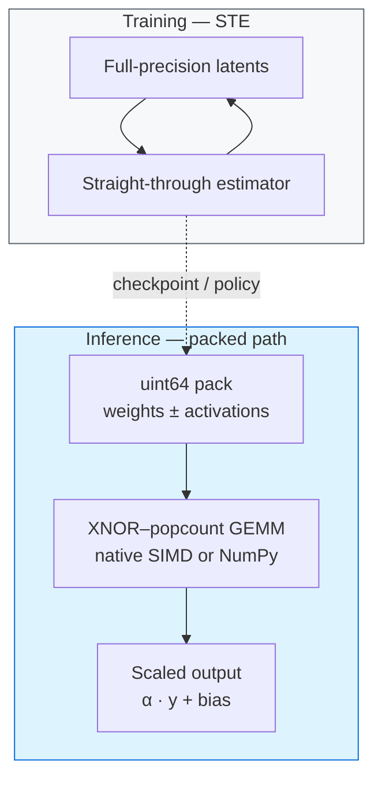
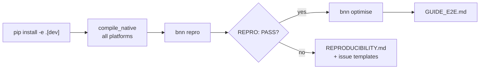
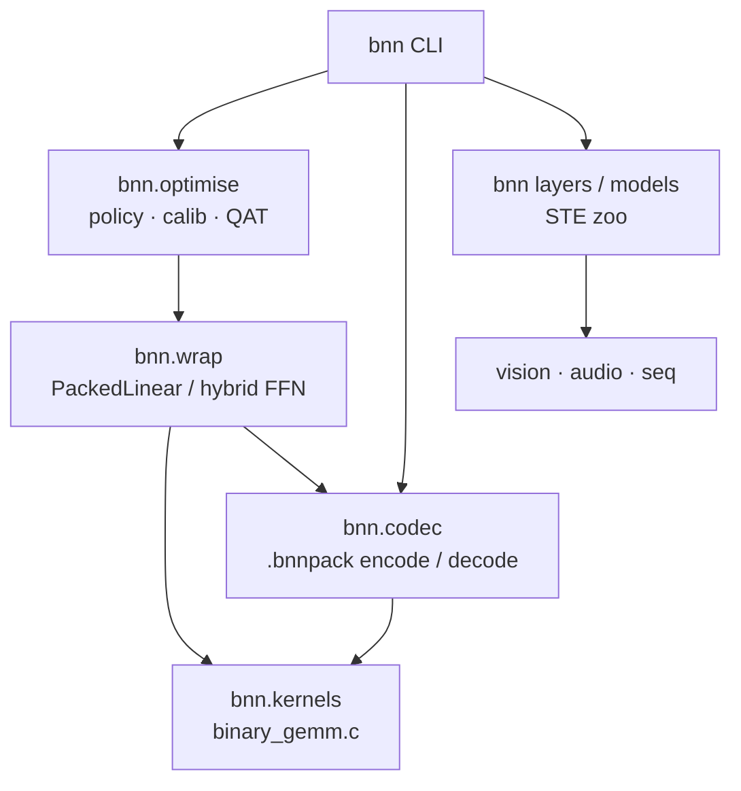
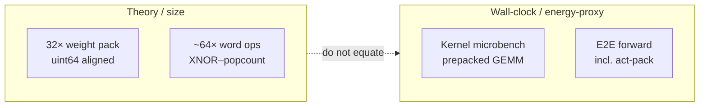
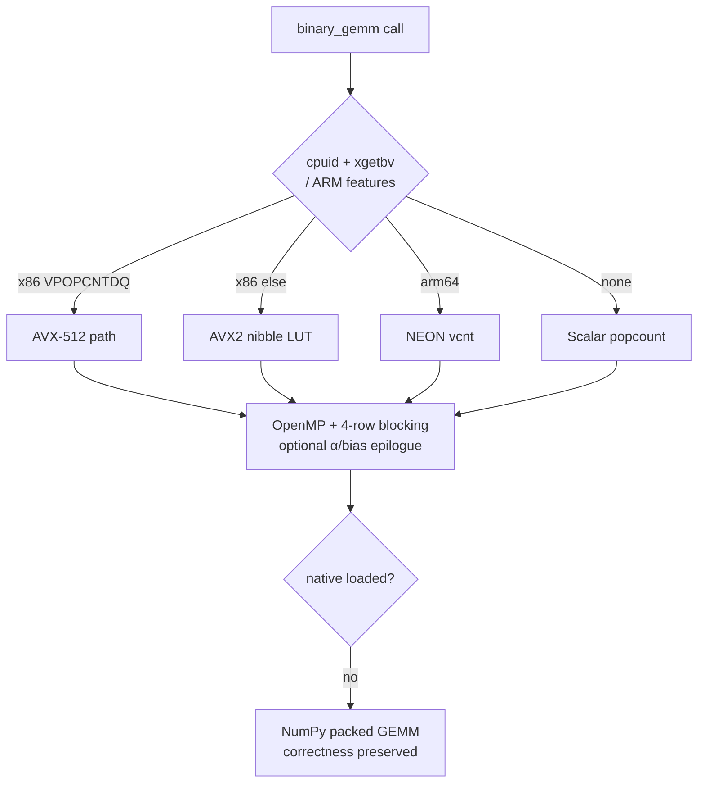
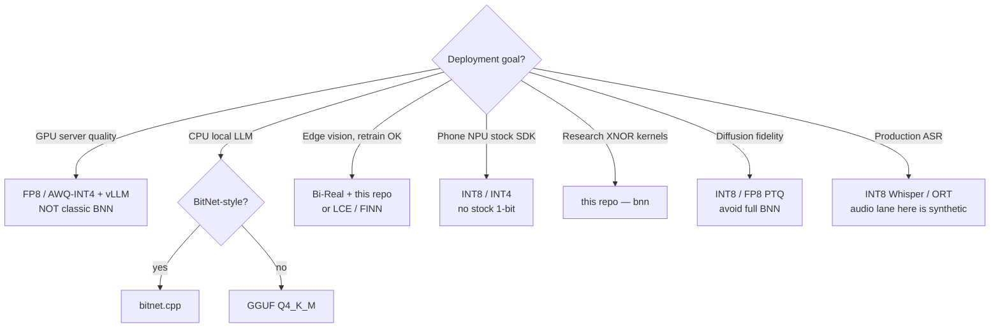

# Binary Neural Networks

### The honest optimiser for packed 1-bit inference on CPU and edge

[](https://github.com/KanakMalpani/Binary-Neural-Networks/actions/workflows/ci.yml)
[](https://github.com/KanakMalpani/Binary-Neural-Networks/actions/workflows/codeql.yml)
[](https://scorecard.dev/viewer/?uri=github.com/KanakMalpani/Binary-Neural-Networks)
[](https://pypi.org/project/bnn-lab/)
[](https://github.com/KanakMalpani/Binary-Neural-Networks/actions/workflows/wheels.yml)
[](https://www.python.org/downloads/)
[](LICENSE)
[](https://github.com/astral-sh/ruff)
[](https://mypy-lang.org/)

**Binary Neural Networks** packs weights (and optionally activations) to **1–1.58 bits** and runs **real** XNOR–popcount kernels on **CPU / edge** — with dual-metric reports that never confuse pack math with wall-clock.

It is a lab **optimiser toolkit** (`bnn 1.0.0`), not a claim that `sign()` is 32× faster on GPU.

<table>
<tr>
<td width="25%" align="center">

### 32.00×
**weight pack**<br/>
<sub>exact, uint64-aligned</sub>

</td>
<td width="25%" align="center">

### err = 0
**every SIMD path**<br/>
<sub>AVX-512 · AVX2 · NEON · scalar</sub>

</td>
<td width="25%" align="center">

### 5.1×
**faster kernel**<br/>
<sub>aggregate over 12 shapes</sub>

</td>
<td width="25%" align="center">

### 29.68×
**measured** RAM<br/>
<sub>not the 32× brochure number</sub>

</td>
</tr>
</table>

> Four numbers, four different kinds of claim — that distinction *is* the product.
> Pack ratio is exact math. `err = 0` is exact integer arithmetic. The kernel
> speedup is wall-clock on one machine. The memory figure is measured from real
> buffers, which is why it is **below** the theoretical 32×.



| Start here | |
|--|--|
| **Human path** | [`docs/GUIDE_E2E.md`](docs/GUIDE_E2E.md) — install → repro → optimise |
| **Reproduce** | [`REPRODUCIBILITY.md`](REPRODUCIBILITY.md) · `bnn repro` |
| **AI agents** | [`AGENTS.md`](AGENTS.md) |
| **Knowledge graph** | [`knowledge_graph/`](knowledge_graph/) · [`docs/44_KNOWLEDGE_GRAPH.md`](docs/44_KNOWLEDGE_GRAPH.md) |
| **Roadmap** | [`ROADMAP.md`](ROADMAP.md) |
| **Compatibility** | [`docs/COMPATIBILITY_MATRIX.md`](docs/COMPATIBILITY_MATRIX.md) — Win/Linux/macOS × x86-64/arm64 |
| **Limits** | [`MODEL_CARD.md`](MODEL_CARD.md) |
| **Kernel internals** | [`docs/41`](docs/41_PORTABLE_SIMD_KERNEL.md) SIMD · [`docs/42`](docs/42_QAT_AND_LAYER_SEARCH.md) QAT+search · [`docs/43`](docs/43_MEMORY_FOOTPRINT.md) memory |
| **Docs index** | [`docs/README.md`](docs/README.md) |

---

## The thesis (locked)

Most “binary” demos train with STE, then infer with `sign()` + `nn.Linear`. That is a **simulation**. On commodity GPUs it is often *slower* than FP32. The 32× you see in papers is usually **bit-pack compression**, not end-to-end latency.

This lab separates the two:

| Locked claim | Meaning |
|--------------|---------|
| Speedups come from **packed kernels** | XNOR + popcount on CPU/edge — not `sign()` theatre |
| Training STE ≠ inference throughput | STE trains latents; inference uses pack + GEMM |
| Compression **32×** | Exact for aligned uint64 binary pack — **size**, not e2e latency |
| Commodity GPU quality | INT4 / FP8 / AWQ / vLLM — documented bridges, not fake BNN wins |
| Repro culture | `bnn repro` + [`tests/golden_floors.json`](tests/golden_floors.json) + committed [`results/*.json`](results/) |



---

## Prove it in five commands

```bat
git clone https://github.com/KanakMalpani/Binary-Neural-Networks.git
cd Binary-Neural-Networks
pip install -e ".[dev]" -c constraints.txt
python -m bnn.kernels.compile_native
bnn repro
```

Expect **`REPRO: PASS`** (exit 0). Fast verify uses committed goldens — same **conclusions**, not bit-identical floats across machines.

Optional: `bnn repro --mode full` for short smoke trains. Prefer `compile_native` on **every** OS (Win/Linux/macOS, x64/arm64) for real XNOR–popcount; Windows needs **MSVC x64** (MinGW 32-bit DLLs fail with WinError 193). No compiler? Install still succeeds — NumPy path keeps correctness. Runtime SIMD ladder: [`docs/41_PORTABLE_SIMD_KERNEL.md`](docs/41_PORTABLE_SIMD_KERNEL.md) (W2.T04/T05).



### Then optimise

```bat
bnn optimise --policy auto --report results\optimise_report.json
```

```python
from bnn.optimise import optimise_model, OptimiseConfig
# docs/tutorials/07_OPTIMISER_QUICKSTART.md
```

Prefer **`bnn optimise`** over legacy `bnn wrap --ultra`. Same hybrid path; clearer product verb and report schema (`bnn_optimise_report_v1`).

---

## How the stack fits together



**Installing does not require a compiler.** `setup.py` builds the kernel when a toolchain is present and falls back to NumPy otherwise. Prebuilt wheels (Linux / macOS / Windows × x86-64 / arm64) ship via the [`wheels`](.github/workflows/wheels.yml) workflow. On PyPI the distribution name is **`bnn-lab`** (`pip install bnn-lab`) — the short name `bnn` is already taken by an unrelated project; the import and CLI stay `bnn`. Live upload needs [Trusted Publishing](docs/PYPI_PUBLISH.md).

```bat
bnn validate-native          # selected ISA path, err = 0
BNN_KERNEL=scalar bnn bench  # force scalar|avx2|avx512|neon
```

---

## Dual metrics — never conflate them



| Quantity | Kind | Do not claim as |
|----------|------|-----------------|
| Weight pack **32.00×** | Exact | End-to-end latency |
| Native GEMM **err = 0** | Exact (when native loaded) | Accuracy of a wrapped LLM |
| ISA paths agree | Exact | Cross-machine float identity |
| Kernel vs NumPy / Torch | Wall-clock (machine-dependent) | Full-model FPS |
| Wrap e2e speedup | Wall-clock (machine-dependent) | Drop-in quality |

Committed snapshot (CPU; see [`results/SUMMARY.md`](results/SUMMARY.md)):

| Check | Result |
|-------|--------|
| Pack compression | **32.0×** (exact) |
| Native GEMM vs ±1 FP32 | **err = 0** |
| Every ISA path agrees bit-for-bit | **err = 0** (binary **and** ternary) |
| 64×4096×4096 compute vs NumPy FP32 | **~23.9×** (machine-dependent) |
| Wrapped Linear, measured RAM | **29.68×** (theoretical 32.00×) |
| MNIST binary / ternary | **96.36%** / **97.16%** (FP **97.67%**) |
| CIFAR Bi-Real vs FP CNN | **61.14%** vs **71.14%** (~10 pp) |
| Audio binary vs FP (synthetic tones) | **96.0%** vs **94.5%** — **not** production ASR |

<details>
<summary><b>Where the kernel speed came from</b> (before → after, same process, min-of-5)</summary>

The old kernel opened a **new OpenMP parallel region per batch row** and
re-streamed all of `W` `B` times. One team per call plus 4-row register blocking,
then runtime SIMD dispatch:

| Shape (B×N×M) | before | after | |
|---|---|---|---|
| 8 × 4096 × 4096 | 0.212 ms | 0.062 ms | 3.4× |
| 64 × 4096 × 4096 | 1.999 ms | 0.437 ms | 4.6× |
| 256 × 1024 × 1024 | 0.739 ms | 0.119 ms | 6.2× |
| 512 × 512 × 512 | 2.038 ms | 0.103 ms | **19.9×** |
| **aggregate, 12 shapes** | **10.74 ms** | **2.12 ms** | **5.1×** |

Tiny shapes are call-overhead bound and unchanged — as expected. Wall-clock moves
with core count, memory bandwidth and thermals; `err = 0` does not.
Details: [`docs/41_PORTABLE_SIMD_KERNEL.md`](docs/41_PORTABLE_SIMD_KERNEL.md).

</details>

> Floors live in [`tests/golden_floors.json`](tests/golden_floors.json). Wall-clock ratios move with CPU, threads, and OpenMP — gates check conclusions, not bit-identical floats.

---

## Runtime: one build, fastest legal SIMD

One C source. ISA chosen at **run** time — never `-march=native` tying a wheel to the builder’s CPU. AVX-512 is used when present, never required.



| Platform | Native | SIMD ladder |
|----------|--------|-------------|
| Linux x86-64 (GCC/Clang) | yes | AVX-512 → AVX2 → scalar |
| Windows x64 (MSVC) | yes | AVX-512 → AVX2 → scalar |
| macOS / Linux arm64 | yes | NEON |
| macOS x86-64 | yes | AVX2 → scalar |
| Anything else | NumPy fallback | correctness first |

Deep dive: [`docs/41_PORTABLE_SIMD_KERNEL.md`](docs/41_PORTABLE_SIMD_KERNEL.md).

---

## When **not** to use this

Honesty is the product. If another stack wins, we say so.



```bat
bnn recommend --goal edge-vision
```

Also skip (or hybrid-skip) when:

- **Small GEMMs / attention projections** — packing overhead dominates; auto policy leaves them FP
- **Drop-in HF LLM without QAT** — cold binary PTQ cosine often collapses; reports refuse drop-in unless `--force`
- **Claiming GPU 32× from `sign()`** — forbidden forever ([good first issue theme](https://github.com/KanakMalpani/Binary-Neural-Networks/issues/1))

Full tree: [`docs/18_DECISION_TREE_AND_COMPLETE_ROADMAP.md`](docs/18_DECISION_TREE_AND_COMPLETE_ROADMAP.md) · limits: [`MODEL_CARD.md`](MODEL_CARD.md).

---

## What you can run next

| Path | Command / entry | Docs |
|------|-----------------|------|
| Optimiser | `bnn optimise --policy auto` | [GUIDE §4](docs/GUIDE_E2E.md) · [tutorial 07](docs/tutorials/07_OPTIMISER_QUICKSTART.md) · [HF 08](docs/tutorials/08_HF_OPTIMISER.md) |
| **Per-layer search** | `bnn.wrap.search_layer_modes(...)` | [docs/42](docs/42_QAT_AND_LAYER_SEARCH.md) — binary vs ternary vs skip, per layer |
| **QAT recovery** | `bnn optimise --qat-steps 200` | [docs/42](docs/42_QAT_AND_LAYER_SEARCH.md) — search *before* QAT |
| **Memory footprint** | `bnn memory --dim 1024 --ff 4096` | [docs/43](docs/43_MEMORY_FOOTPRINT.md) — resident vs theoretical |
| Codec | `bnn encode` / `bnn decode` | [GUIDE §5](docs/GUIDE_E2E.md) |
| MNIST STE | `bnn train --epochs 3 --seed 42` | pedagogy — not a throughput win |
| Vision | `bnn train-image --epochs 8 --subset 30000` | [tutorial 04](docs/tutorials/04_image_cifar.md) |
| Audio | `bnn train-audio --epochs 5` | [tutorial 05](docs/tutorials/05_audio.md) — synthetic only |
| Seq2seq / profile | `bnn train-seq2seq` · `bnn profile` | [tutorial 06](docs/tutorials/06_encoder_decoder.md) |

### The layer search, in one table

`search_layer_modes` starts every layer binary and relaxes whatever costs the
most quality, re-measuring the **whole** model each step. The trade-off is
monotonic — and tested as such, because a search that ever reported *more*
compression at *higher* quality would be lying:

| `quality_floor` | final cosine | theoretical compression | assignment |
|---|---|---|---|
| 0.00 | 0.271 | **32.0×** | 3 binary |
| 0.90 | 0.950 | 1.71× | 1 ternary, 2 skip |
| 0.999 | 1.000 | 1.00× | 3 skip |

That first row is the honest headline: **32× is available, at cosine 0.27.**
Which is exactly why the search exists.

```
bnn/           STE, layers, models, optimise, export, determinism
bnn/wrap/      hybrid policy, calib, QAT, PackedLinear
bnn/kernels/   portable XNOR GEMM (+ optional native)
bnn/codec/     .bnnpack encode / decode
bnn/vision/    CIFAR Bi-Real, tiny binary ViT
bnn/audio/     STFT + synthetic tones
bnn/seq/       binary Transformer encoder / decoder
results/       committed golden JSON + SUMMARY.md
tests/         pytest + golden_floors.json
```

Public API: `import bnn` — [`docs/api/README.md`](docs/api/README.md). CLI: `bnn --help` · `bnn --version`.

---

## Is / is not

| Is | Is not |
|----|--------|
| Honest CPU / edge proof of packed binary speedups | A promise of 32× e2e everywhere |
| Trainable BNN + BitLinear pedagogy + optimiser | Full BitNet LLM pretrain |
| Dual-metric culture and repro gates | Bit-identical floats across OS/CPU |
| Bridges toward INT4 / FP8 / bitnet.cpp | A cuDNN / TensorRT replacement |
| Lab / beta on the road to v1.0 | “World-class optimiser” until [`ROADMAP.md`](ROADMAP.md) WC gates pass |

---

## Contributing & quality

- [`CONTRIBUTING.md`](CONTRIBUTING.md) · [`CHANGELOG.md`](CHANGELOG.md) · [`SECURITY.md`](SECURITY.md) · [`docs/LAUNCH_CHECKLIST.md`](docs/LAUNCH_CHECKLIST.md)
- Product direction: [`ROADMAP.md`](ROADMAP.md) (Phases A→F; workstreams W1–W14)
- API reference is **generated** from docstrings (`mkdocs build --strict` in CI) — see [`docs/api/`](docs/api/); a renamed symbol breaks the build rather than silently emptying a page
- Supply chain: wheels + sdist carry signed [build provenance](https://docs.github.com/actions/security-guides/using-artifact-attestations) (`gh attestation verify`), and `pip-audit` is a **hard gate** on the shipped dependency set with every ignore triaged in [`ci.yml`](.github/workflows/ci.yml)
- Agents: [`AGENTS.md`](AGENTS.md) — do not invent alternate golden shapes
- CI: [`ci.yml`](.github/workflows/ci.yml) — quality (ruff/mypy/coverage ≥80%), Windows + Linux native (export-check, repro), **portability** (linux-arm64 NEON, macos-arm64 NEON, macos-x86_64) per [`COMPATIBILITY_MATRIX.md`](docs/COMPATIBILITY_MATRIX.md), Python 3.11–3.13; plus [CodeQL](.github/workflows/codeql.yml), [Scorecard](.github/workflows/scorecard.yml), [wheels](.github/workflows/wheels.yml)

```bat
bnn export-check
bnn validate-native
bnn bench
bnn eval-suite
```

---

**License:** [MIT](LICENSE) · **Citation:** [`CITATION.cff`](CITATION.cff) · **Repo:** [KanakMalpani/Binary-Neural-Networks](https://github.com/KanakMalpani/Binary-Neural-Networks)
