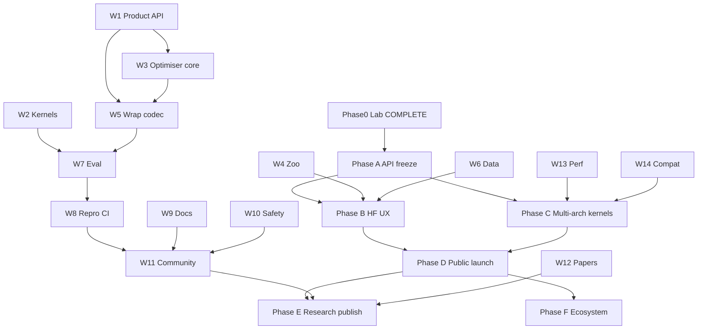

# ROADMAP — World-Class Binary Neural Network Optimiser

| Field | Value |
|-------|-------|
| **Status** | Canonical living plan (agents: follow when lost) |
| **Version** | 1.0.0 (lab optimiser; `bnn-lab` 1.0.0 on PyPI) |
| **Created** | 2026-07-25 |
| **Canonical paths** | `/ROADMAP.md` (this file) · identical twin `docs/37_WORLD_CLASS_BNN_OPTIMISER_ROADMAP.md` |
| **Supersedes (execution)** | `docs/21` remains historical COMPLETE lab plan; **this file** is the forward “world-class optimiser” plan |
| **Repo** | https://github.com/KanakMalpani/Binary-Neural-Networks |
| **Thesis lock** | Packed CPU/edge XNOR-popcount + honest STE; **never** claim GPU 32× from `sign()` |

> **Agents:** when lost, read **§0 → §7 → current phase in §5 → lowest unchecked `[ ]` in §10**. Run `bnn repro`. Do not invent new benchmark shapes. Update checkboxes in the same PR.

---

## What more can we do? (executive — answer first)

We already shipped an **honest, installable, reproducible lab** (packaging, MSVC OpenMP kernels, wrap/calib/QAT sketch, `.bnnpack`, encoder/decoder, vision/audio lanes, repro gates, dual-metric culture). The gap to a **world-class Binary Neural Network Optimiser** is productization of the optimiser path and multi-platform runtime — not more thesis papers claiming fake speedups.

**Highest-leverage next moves (priority order):**

1. **Freeze a public optimiser API** (`bnn.optimise` / stable `wrap_model` surface + semver + deprecation) so HF/PyTorch users get one obvious entrypoint.
2. **Hugging Face + safetensors UX** — load → calibrate → policy → encode `.bnnpack` → report Pareto (accuracy / size / latency) without tribal knowledge.
3. **Multi-arch kernels** — **Delivered:** portable runtime SIMD (AVX-512 → AVX2 → NEON → scalar) on Win/Linux/macOS/ARM via `docs/41`; keep NumPy correctness fallback; optional WASM later.
4. **Fair eval protocol + regression budgets** — published shapes only; latency–energy–accuracy Pareto; no new “golden” inventiveness.
5. **OSS launch hygiene** — LICENSE file, issue/PR templates, CODEOWNERS, release tags, SBOM, model cards, Sphinx/MkDocs API.

**Later / moonshots:** layer-wise search, BitNet-scale bridges (delegate LLM serve to bitnet.cpp), ONNX export, RAPL energy, community leaderboard — only after API + HF UX + multi-arch kernels are solid.

**Explicit non-answers:** inventing alternate benches; CUDA-BNN “32×”; full ImageNet SOTA; production ASR; stock phone-NPU 1-bit.

---

## Table of contents

0. [North star & non-goals](#0-north-star--non-goals)
1. [Definition of World-Class (acceptance bar)](#1-definition-of-world-class-acceptance-bar)
2. [Current state scorecard](#2-current-state-scorecard)
3. [What more can we do (prioritized backlog)](#3-what-more-can-we-do-prioritized-backlog)
4. [Workstreams (detailed task IDs)](#4-workstreams-detailed-task-ids)
5. [Phased timeline](#5-phased-timeline)
6. [Dependency graph](#6-dependency-graph)
7. [Agent execution protocol](#7-agent-execution-protocol)
8. [Release checklist](#8-release-checklist)
9. [Risk register](#9-risk-register)
10. [Living progress tracker](#10-living-progress-tracker)
11. [Appendix — file map & related docs](#11-appendix--file-map--related-docs)

---

## 0. North star & non-goals

### 0.1 Vision one-pager

Build the **default open toolkit** for people who want to **optimise** neural nets for **CPU / edge** via **binary / ternary / hybrid low-bit packing**:

- Take an existing or trainable PyTorch model.
- Decide **honestly** what can be binary vs ternary vs FP (policy + calibration + optional QAT).
- Pack to portable **`.bnnpack`**, run **real** XNOR-popcount (or ternary) kernels.
- Report **dual metrics**: theoretical word reduction **and** wall-clock / energy-proxy — never conflate them.
- When the right tool is GPU INT4/FP8 or bitnet.cpp / GGUF — **say so and bridge**, don’t fake a BNN win.

Positioning: **Binary Neural Network Optimiser lab/product**, not “another MNIST demo repo.”

### 0.2 Thesis lock (immutable)

| Locked | Meaning |
|--------|---------|
| Speedups come from **packed kernels** on CPU/edge | `sign()` + `nn.Linear` is simulation / anti-pattern |
| Training STE ≠ inference throughput | STE trains latents; inference uses pack + popcount |
| Compression **32×** is exact for aligned uint64 pack | Not an e2e latency claim |
| Commodity GPU path | INT4 / FP8 / AWQ / vLLM / torchao — documented bridges |
| Repro culture | `bnn repro` + `tests/golden_floors.json` + committed `results/*.json` |
| No invented goldens | Same shapes / same conclusions; floats may differ across machines |

### 0.3 Explicit non-goals

- [ ] ~~Claim GPU 32× from binary `sign()`~~ — **FORBIDDEN forever**
- [ ] Full BitNet-scale LLM pretrain inside this repo
- [ ] Full ImageNet SOTA training schedule as a gate
- [ ] Production ASR / Whisper replacement (audio lane = synthetic pedagogy)
- [ ] Stock phone NPU 1-bit (vendors ship INT8/INT4 — see `docs/20`)
- [ ] Replacing cuDNN / TensorRT
- [ ] Committing `data/` datasets or force-pushing history
- [ ] Bit-identical floats across OS/CPU as a pass criterion

### 0.4 Relationship to prior roadmaps

| Doc | Role now |
|-----|----------|
| **`ROADMAP.md` / `docs/37_…`** | **Canonical** world-class optimiser plan |
| `docs/21_E2E_ROADMAP_COMPLETE_REPO.md` | Historical lab COMPLETE (D1–D12); points here for next phase |
| `docs/10_ROADMAP.md` | Thin pointer → this file |
| `docs/18`, `19`, `22`, `28`, `29`, `31`, `36` | Evidence / decision tree / completion / lane notes — do not contradict thesis |

---

## 1. Definition of World-Class (acceptance bar)

A future agent may claim **“world-class BNN optimiser (v1.0)”** only when **all** gates below pass. Until then, say **lab / beta optimiser**.

### 1.1 Product & API

| ID | Gate | Criterion |
|----|------|-----------|
| **WC-A1** | Stable optimiser entry | One documented API: optimise/wrap → report → encode; semver; deprecation policy in `docs/` |
| **WC-A2** | CLI completeness | `bnn optimise` (or frozen `bnn wrap --ultra`) covers calibrate → policy → QAT → pack → report |
| **WC-A3** | Version honesty | `bnn.__version__` matches tags; CHANGELOG Keep-a-Changelog |

### 1.2 Correctness & kernels

| ID | Gate | Criterion |
|----|------|-----------|
| **WC-K1** | Pack compression | Binary aligned pack **32.00×** ±0.01 (`export-check`) |
| **WC-K2** | GEMM identity | Native (when present) **err = 0** vs ±1 FP; NumPy path err = 0 |
| **WC-K3** | Multi-OS runtime | At least **Windows native** + **Linux native OR documented equivalent**; macOS/ARM: native or explicit fallback with tests |
| **WC-K4** | Dual-metric benches | Theory vs wall-clock published; regression budgets in CI |

### 1.3 Optimiser quality

| ID | Gate | Criterion |
|----|------|-----------|
| **WC-O1** | Calibration | Documented calib APIs; report cosine / top1 / compression |
| **WC-O2** | Auto policy | `auto` chooses binary vs ternary vs skip with reasons |
| **WC-O3** | Drop-in honesty | Thresholds + `--force`; never claim drop-in without metrics |
| **WC-O4** | QAT path | Reproducible short QAT improves cosine vs cold PTQ on documented demo |

### 1.4 Repro, CI, security

| ID | Gate | Criterion |
|----|------|-----------|
| **WC-R1** | `bnn repro` | Exit 0 / `REPRO: PASS` on clean install |
| **WC-R2** | CI matrix | Windows + Linux (+ macOS when feasible); Python 3.11–3.13 smoke |
| **WC-R3** | Supply chain | LICENSE on disk; SBOM on release; `weights_only` / path guards |
| **WC-R4** | No secret/data commits | `data/` gitignored; hooks or CI scan |

### 1.5 Docs, community, ethics

| ID | Gate | Criterion |
|----|------|-----------|
| **WC-D1** | Tutorials | End-to-end optimiser tutorial (HF or local) + existing 01–06 kept green |
| **WC-D2** | API reference | Generated or maintained Sphinx/MkDocs (beyond stub) |
| **WC-D3** | Model / limitation cards | Honest failure modes (attn, small GEMM, PTQ collapse) |
| **WC-D4** | Community files | CONTRIBUTING, CODE_OF_CONDUCT, issue/PR templates, SECURITY.md |
| **WC-D5** | Public launch | Tagged v1.0, README badges, Discussions or clear issue triage |

### 1.6 Research honesty

| ID | Gate | Criterion |
|----|------|-----------|
| **WC-P1** | Paper pointer | Local research series linked; claims match measured goldens |
| **WC-P2** | Bridges | GPU INT4/FP8 + bitnet.cpp recipes stay first-class “use this instead when…” |

---

## 2. Current state scorecard

Audit date: **2026-07-28** (SIMD/portability refresh). Status legend: `[x] DONE` · `[~] PARTIAL` · `[ ] TODO`.

| Area | Status | Evidence (paths) | Gap to world-class |
|------|--------|------------------|--------------------|
| Packaging / version | `[x]` | `pyproject.toml` **`bnn-lab`** 1.0.0 on PyPI (import/CLI `bnn`), console script | Recurring releases; no Windows ARM64 / no `cp313-win_amd64` in 1.0.0 |
| CLI surface | `[x]` | `bnn optimise` + wrap/encode/bridge/… | HF load verb optional |
| STE layers / models | `[x]` | `bnn/ste.py`, `layers.py`, `models.py` | Broader zoo polish optional |
| Native binary GEMM | `[x]` | Win/Linux/macOS/ARM native + runtime SIMD (`docs/41`); NumPy fallback | Arena declined; WASM pedagogy shipped |
| Ternary kernels | `[~]` | `ternary_pack.py`, `ternary_gemm.py` / C bitplanes | Cross-platform polish |
| Wrap / ultra wrap | `[x]` | `bnn/wrap/*` + sensitivity/search + distill + BN fuse | Richer HW detect |
| Calibrate / QAT | `[x]` | `wrap/calibrate.py`, `wrap/qat.py`, `wrap/distill.py`, docs/42 | BitDistill-scale optional |
| Auto policy | `[x]` | `wrap/policy.py` + `search_layer_modes` (W3.T06) | Richer HW detect |
| Codec `.bnnpack` | `[x]` | v2 + hashes + safetensors export; ONNX bridge-only | ORT custom op stays deferred |
| Seq enc/dec | `[x]` | `bnn/seq/`, `train_seq2seq`, tutorial 06 | Scale / real NLP tasks optional |
| Vision | `[x]` | CIFAR Bi-Real + ResNet-BiReal ref; ImageNet protocol runner | Full ImageNet SOTA non-gate |
| Audio | `[~]` | `bnn/audio/` synthetic tones | Real dataset optional; keep ASR non-goal |
| Math identities | `[x]` | `bnn/math/*`, `docs/35`, tests | Keep as regression forever |
| Profile / bench | `[x]` | profile + Pareto + memory + energy-proxy; RAPL spike | Privileged wrap-workload RAPL optional |
| Repro / goldens | `[x]` | `scripts/repro_all.py`, `golden_floors.json`, `REPRODUCIBILITY.md`, `AGENTS.md` | Broader OS matrix |
| CI | `[x]` | Win + Linux native hard + py3.11–3.13 + **portability** (ARM/macOS) | Attestations on wheels dry-run |
| Docs research 00–36 | `[x]` | `docs/` + MkDocs autodoc | Venue submit optional |
| API reference | `[x]` | docs/api autodoc (mkdocstrings) | — |
| Tutorials | `[x]` | `docs/tutorials/01`–`08` | Keep green |
| Bridges GPU/BitNet | `[x]` | `bnn bridge …` + pinned bitnet recipe (no giant submodule) | Full upstream build stays local |
| HF integration | `[x]` | tutorial 08 + optional hf tests | deeper calib recipes |
| Community OSS | `[x]` | LICENSE, templates, COC, SECURITY, CODEOWNERS, CONTRIBUTING, launch checklist, Discussions, branch protection | Venue / Hub collection optional |
| Security | `[x]` | SECURITY.md + SBOM + hard pip-audit + attestations | — |
| Releases | `[x]` | `v1.0.0` + SBOM + `wheels.yml` OIDC → **`bnn-lab` 1.0.0 on PyPI** | Recurring tags; skip frozen `v1.0.0` wheel matrix |
| Papers / research series | `[x]` | `docs/32`, publication plan, figure pipeline, CITATION.cff | Venue submit optional |
| Compatibility matrix | `[x]` | docs + CI matrix 3.11–3.13 + portability | Keep matrix honest |
| Memory arena / thread pool API | `[x]` | OpenMP thread setter + footprint report | Arena measured & declined (docs/43) |
| WASM | `[x]` | Pedagogy SIMD popcount (`wasm/`, `docs/spikes/WASM_SIMD.md`) | Not a native-kernel substitute |
| ONNX / safetensors | `[~]` | safetensors shipped; ONNX bridge-only defer | ORT custom op remains deferred |
| Leaderboard protocol | `[~]` | fair protocol + template | Community submissions |
| Model cards / ethics | `[x]` | MODEL_CARD.md | Expand ethics essay optional |

### 2.1 Inventory snapshot (what exists)

**CLI (`bnn`):** `compile-native`, `validate-native`, `bench`, `export-check`, `train`, `train-cifar`, `train-image`, `train-audio`, `train-seq2seq`, `repro`, `wrap` (+ `--ultra`), `optimise`, `pareto`, `wrap-transformer`, `encode`, `decode`, `profile`, `energy-bound`, `eval-suite`, `recommend`, `bridge`, `kg`, `memory`, `version`.

**Packages:** `bnn` core, `kernels` (+ `wasm` pedagogy), `wrap`, `codec`, `seq`, `vision`, `audio`, `math`, `profile`, `energy`.

**Gates:** compression 32×, native err=0, MNIST/CIFAR/audio floors, bench regression, codec round-trip.

**Docs:** research map closed (`docs/09`/`19`); lab COMPLETE (`docs/22`); encoder/codec lane (`docs/36`).

---

## 3. What more can we do (prioritized backlog)

### 3.1 Now (Phase A–B — next 2–6 weeks of agent work)

| # | Item | Why | Primary IDs |
|---|------|-----|-------------|
| 1 | Add root `LICENSE` (MIT as declared) | Legal clarity for OSS | W11.T01 |
| 2 | Write optimiser API ADR + freeze surface | World-class = clear product | W1.T01–T04 |
| 3 | `bnn optimise` CLI wrapping ultra path | One verb users remember | W1.T05, W3.T01 |
| 4 | HF load → wrap → `.bnnpack` tutorial + test | Real “optimiser” story | W5.T01–T04, W9.T01 |
| 5 | Issue/PR templates + SECURITY.md + COC | Launch readiness | W11.T02–T05 |
| 6 | Point all old roadmaps here; keep repro green | Agent orientation | W9.T02, W8.T01 |

### 3.2 Next (Phase C — multi-arch & eval)

| # | Item | Why | Primary IDs |
|---|------|-----|-------------|
| 7 | Linux native `.so` build in CI | Not Windows-only credibility | W2.T01–T03, W14.T01 |
| 8 | ~~ARM NEON path or documented roadmap spike~~ **DONE** (`docs/41`) | Edge story | W2.T04 |
| 9 | Pareto report JSON schema + plots | Optimiser output users need | W7.T01–T04 |
| 10 | Regression latency budgets tightened | Perf engineering culture | W13.T01–T03 |
| 11 | `.bnnpack` v2 design (ternary + meta) | Codec longevity | W5.T05–T07 |

### 3.3 Later (Phase D–E — launch & research)

| # | Item | Why | Primary IDs |
|---|------|-----|-------------|
| 12 | PyPI + GitHub Release + SBOM | Distribution | W8.T05–T08 |
| 13 | MkDocs/Sphinx site | DX | W9.T05–T08 |
| 14 | Model card + ethics/limitations | Trust | W10.T01–T04 |
| 15 | Paper write-up aligned to goldens | Research | W12.T01–T05 |
| 16 | Layer-wise sensitivity search | Differentiator | W3.T05–T08 |

### 3.4 Moonshots (Phase F — only after D)

| # | Item | Notes |
|---|------|-------|
| M1 | WASM SIMD popcount demo | **Delivered** (pedagogy) — `wasm/`, Node/HTML demos |
| M2 | ~~AVX-512 VPOPCNTDQ kernel~~ **DONE** (runtime dispatch; never required) | See `docs/41` + spike note |
| M3 | ONNX Runtime custom op | **Deferred** bridge-only — `docs/spikes/ONNX_BRIDGE_ONLY.md` |
| M4 | Community leaderboard | Fair protocol first (W7) |
| M5 | RAPL / board Joules | **Spike delivered** — Linux RAPL + Windows CLOSED-BY-PROXY |
| M6 | Full ResNet-18 Bi-Real ImageNet *protocol runner* | **Runner delivered** (smoke/proxy; no SOTA gate) |

### 3.5 Rationale (why this order)

World-class optimisers (torchao, bitsandbytes, optimum, llama.cpp quant tools) win on **clear API**, **trustworthy metrics**, and **cross-platform runtime** — not on a longer MNIST table. We already have the hard science honesty; we must productize it without breaking the thesis lock.

---

## 4. Workstreams (detailed task IDs)

Estimate key: **S** ≤0.5d · **M** ≤2d · **L** ≤1w · **XL** multi-week.  
Acceptance: every task that touches metrics must keep `bnn repro` green unless explicitly refreshing goldens with justification.

---

### W1 — Product & API

**Goal:** A stable, versioned **optimiser** API that outsiders can depend on.  
**Why world-class:** Labs have scripts; products have contracts.

| ID | Task | Est | Deps | Status |
|----|------|-----|------|--------|
| W1.T01 | ADR: public API surface (`optimise_model`, reports, codec) | S | — | `[x]` |
| W1.T02 | Semver + deprecation policy doc | S | W1.T01 | `[x]` |
| W1.T03 | Freeze `bnn.wrap.api` exports in `__all__` / `docs/api` | M | W1.T01 | `[x]` |
| W1.T04 | Compatibility tests for public symbols | M | W1.T03 | `[x]` |
| W1.T05 | CLI `bnn optimise` (alias to ultra wrap + encode) | M | W1.T01 | `[x]` |
| W1.T06 | JSON report schema v1 (versioned) | M | W1.T05 | `[x]` `bnn_optimise_report_v1` |
| W1.T07 | Deprecation warnings for legacy-only paths | S | W1.T02 | `[x]` |
| W1.T08 | PyPI package description / classifiers polish | S | W8 | `[x]` mostly done |

**Acceptance tests:** import stable symbols; `bnn optimise --help`; schema validates demo JSON; `bnn repro`.  
**Follow when lost (next 3):** W1.T01 → W1.T05 → W1.T06.

---

### W2 — Kernels & runtime

**Goal:** Correct, fast packed GEMM wherever users run; fallback always correct.  
**Why world-class:** A Windows-only DLL is a lab; multi-arch is a runtime.

| ID | Task | Est | Deps | Status |
|----|------|-----|------|--------|
| W2.T01 | Document current OpenMP MSVC path + thread API | S | — | `[x]` C + docs/34 |
| W2.T02 | Linux GCC/Clang `.so` compile path | L | W2.T01 | `[x]` `compile_native` |
| W2.T03 | CI job: build + `validate-native` on Linux | M | W2.T02 | `[x]` hard gate |
| W2.T04 | ARM NEON path (Apple Silicon / aarch64 Linux) | L | W2.T02 | `[x]` `docs/41` + portability CI |
| W2.T05 | AVX2 / AVX-512 optional runtime dispatch | XL | W2.T02 | `[x]` `docs/41` (AVX-512 never required) |
| W2.T06 | WASM SIMD prototype (optional) | XL | W2.T02 | `[x]` pedagogy (`wasm/`, spike) |
| W2.T07 | Memory arena for packed buffers | L | W2.T02 | `[x]` **measured, declined** — alloc is 1.4–1.8% of GEMM; reuse would alias `torch.from_numpy` views (see docs/43) |
| W2.T08 | Document GPU bridge non-goal for classic BNN | S | — | `[x]` docs/24 |
| W2.T09 | Ternary native parity tests cross-OS | M | W2.T02 | `[x]` cross-ISA bit-identity tests |
| W2.T10 | Fail-loud native probe UX (already partial) | S | — | `[x]` validate-native |

**Acceptance tests:** err=0; bench floors; thread scaling smoke; no claim without dual metrics.  
**Follow when lost:** W2.T07 (arena) → W2.T06 (WASM optional) → W2.T09 (ternary polish).

---

### W3 — Optimiser core

**Goal:** Calibrate → sensitivity → auto policy → optional QAT/distill → pack.  
**Why world-class:** This *is* the product.

| ID | Task | Est | Deps | Status |
|----|------|-----|------|--------|
| W3.T01 | Unify calibrate entrypoints | M | W1 | `[x]` `wrap/calibrate.py` |
| W3.T02 | Effectiveness report always emitted | M | W3.T01 | `[x]` |
| W3.T03 | Auto policy reasons in report | S | — | `[x]` |
| W3.T04 | Drop-in threshold tests | S | — | `[x]` `tests/test_wrap_wco.py` |
| W3.T05 | Layer-wise sensitivity (ablate / score) | L | W3.T01 | `[x]` |
| W3.T06 | Search: binary vs ternary vs skip per layer | L | W3.T05 | `[x]` `search_layer_modes` — docs/42 |
| W3.T07 | QAT recipe docs + longer runnable path | M | W3.T01 | `[x]` docs/42 |
| W3.T08 | Distill integration beyond `distill_sketch.py` | L | W3.T07 | `[x]` `wrap/distill.py` + `OptimiseConfig.distill_steps` |
| W3.T09 | BN fuse in optimiser path | M | — | `[x]` `wrap/fuse.py` + `OptimiseConfig.fuse_bn` |
| W3.T10 | Guardrails: refuse known-bad shapes with message | M | W3.T03 | `[x]` |

**Acceptance tests:** documented demo improves cosine with QAT; auto policy deterministic under seed; repro green.  
**Follow when lost:** W3.T01 → W3.T05 → W3.T06.

---

### W4 — Model zoo & architectures

**Goal:** Reference architectures that show *where* binary wins / loses.  
**Why world-class:** Optimisers ship zoos + recipes, not one MLP.

| ID | Task | Est | Deps | Status |
|----|------|-----|------|--------|
| W4.T01 | MNIST binary/ternary MLP | S | — | `[x]` |
| W4.T02 | CIFAR Bi-Real CNN | S | — | `[x]` |
| W4.T03 | Tiny Binary ViT | M | — | `[x]` |
| W4.T04 | Binary Transformer enc/dec | M | — | `[x]` |
| W4.T05 | ResNet-BiReal reference (CIFAR or tiny) | L | W4.T02 | `[x]` `ResNetBiRealCIFAR` |
| W4.T06 | BitLinear / BitNet-style block pedagogy | M | — | `[x]` pinned bitnet.cpp recipe + `bnn bridge` |
| W4.T07 | Diffusion note (prefer INT8/FP8) | S | — | `[x]` decision tree |
| W4.T08 | Zoo registry JSON (name → build → recipe) | M | W4.* | `[x]` |

**Acceptance tests:** each zoo entry has train or wrap smoke + doc link.  
**Follow when lost:** W4.T08 → W4.T05 → W4.T06.

---

### W5 — Wrap & codec

**Goal:** Portable artifacts + ecosystem loaders.  
**Why world-class:** Without a format + HF path, wrap dies in-process.

| ID | Task | Est | Deps | Status |
|----|------|-----|------|--------|
| W5.T01 | `.bnnpack` v1 encode/decode | M | — | `[x]` |
| W5.T02 | Security: `weights_only` load | S | — | `[x]` |
| W5.T03 | HF tiny wrap demo | M | hf extra | `[x]` |
| W5.T04 | HF optimiser tutorial + CI-optional test | L | W5.T03, W1 | `[x]` |
| W5.T05 | `.bnnpack` v2 design (ternary, meta, hashes) | L | W5.T01 | `[x]` ADR 0003 + v2 writers |
| W5.T06 | safetensors export of packed tensors | L | W5.T05 | `[x]` `codec/safetensors_export.py` |
| W5.T07 | ONNX export spike (or explicit defer) | XL | W5.T05 | `[x]` bridge-only spike |
| W5.T08 | Round-trip tests in default pytest | M | W5.T01 | `[x]` `test_codec.py` |
| W5.T09 | Wrap Conv2d packed path polish | M | — | `[x]` |

**Acceptance tests:** encode→decode err=0; HF demo optional marker `slow`; schema version field.  
**Follow when lost:** W5.T04 → W5.T05 → W5.T06.

---

### W6 — Data & modalities

**Goal:** Honest multi-modal recipes without claiming SOTA.  
**Why world-class:** Clear dataset cards beat silent `data/` folders.

| ID | Task | Est | Deps | Status |
|----|------|-----|------|--------|
| W6.T01 | MNIST loader (no torchvision required) | S | — | `[x]` |
| W6.T02 | CIFAR HF/proxy path | M | — | `[x]` |
| W6.T03 | Audio synthetic lane | M | — | `[x]` |
| W6.T04 | Dataset cards (MNIST/CIFAR/synth audio) | M | — | `[x]` |
| W6.T05 | Seq reverse-task card | S | — | `[~]` in docs/36 |
| W6.T06 | Training recipes index | M | W4, W9 | `[x]` |
| W6.T07 | ImageNet folder protocol only | S | — | `[x]` runner (`scripts/imagenet_protocol.py`) |
| W6.T08 | Never commit datasets | S | — | `[x]` policy |

**Follow when lost:** W6.T04 → W6.T06 → W6.T05.

---

### W7 — Eval & benchmarks

**Goal:** Fair, comparable, dual-metric evaluation.  
**Why world-class:** Leaderboard culture without cheating shapes.

| ID | Task | Est | Deps | Status |
|----|------|-----|------|--------|
| W7.T01 | Keep golden floors / committed results | — | — | `[x]` |
| W7.T02 | Document allowed bench shapes (forbid inventing) | S | — | `[x]` docs/BENCH_SHAPES.md |
| W7.T03 | Pareto JSON: accuracy, compression, latency, energy-proxy | M | W1.T06 | `[x]` |
| W7.T04 | Plot script (optional mpl extra) | M | W7.T03 | `[x]` optional mpl |
| W7.T05 | Fair protocol doc (warmup, threads, CPU model) | M | W7.T02 | `[x]` |
| W7.T06 | Robustness FGSM keep as optional | S | — | `[x]` script |
| W7.T07 | Leaderboard template (manual submissions) | L | W7.T05 | `[x]` |
| W7.T08 | `eval-suite` includes codec + seq smokes | M | — | `[x]` |

**Follow when lost:** W7.T02 → W7.T03 → W7.T05.

---

### W8 — Repro & CI/CD

**Goal:** Others get `REPRO: PASS`; releases are attested.  
**Why world-class:** Trust is automated.

| ID | Task | Est | Deps | Status |
|----|------|-----|------|--------|
| W8.T01 | `bnn repro` verify/full | — | — | `[x]` |
| W8.T02 | CI Windows + Linux pytest + repro | — | — | `[x]` |
| W8.T03 | Python 3.11 / 3.12 / 3.13 matrix | M | — | `[x]` |
| W8.T04 | macOS CI (NumPy or native) | M | W2 | `[x]` `portability` job (arm64 + x86_64) |
| W8.T05 | Tagged GitHub Releases | M | W1 | `[x]` v1.0.0 |
| W8.T06 | SBOM (e.g. cyclonedx) on release | M | W8.T05 | `[x]` script + docs |
| W8.T07 | Artifact attestations | L | W8.T05 | `[x]` `attest-build-provenance` on wheels + sdist |
| W8.T08 | PyPI publish workflow (Trusted Publishing) | L | W8.T05 | `[x]` `bnn-lab` 1.0.0 on PyPI (OIDC Trusted Publisher; `docs/PYPI_PUBLISH.md`) |
| W8.T09 | constraints.txt discipline | S | — | `[x]` |
| W8.T10 | Native compile in CI not `continue-on-error` when possible | M | W2.T03 | `[x]` Linux hard; Win soft |

**Follow when lost:** W8.T03 → W8.T05 → W8.T06.

---

### W9 — Docs & DX

**Goal:** A stranger becomes productive in <30 minutes.  
**Why world-class:** Docs *are* the product surface.

| ID | Task | Est | Deps | Status |
|----|------|-----|------|--------|
| W9.T01 | Optimiser quickstart tutorial | M | W1.T05 | `[x]` |
| W9.T02 | Make this ROADMAP the single “when lost” entry | S | — | `[x]` this PR |
| W9.T03 | Sync README / docs/README pointers | S | W9.T02 | `[x]` |
| W9.T04 | Keep tutorials 01–06 green | — | — | `[x]` |
| W9.T05 | MkDocs or Sphinx decision ADR | S | — | `[x]` MkDocs stub |
| W9.T06 | Autodoc API reference | L | W9.T05 | `[x]` mkdocstrings, 7 pages, `--strict` in CI |
| W9.T07 | Architecture Decision Records index | M | docs/08 | `[x]` docs/adr |
| W9.T08 | “When to use BNN vs INT4” cookbook | M | docs/18 | `[x]` GUIDE_E2E §8 + docs/18 |
| W9.T09 | Troubleshooting runbook expand | M | REPRODUCIBILITY | `[x]` GUIDE_E2E §11 + REPRO |
| W9.T10 | GIF/asciinema optional demos | S | — | `[x]` `docs/demos/optimise_quickstart.cast` |

**Follow when lost:** W9.T03 → W9.T01 → W9.T06.

---

### W10 — Safety, ethics, security

**Goal:** Honest limitations; safe loading; supply chain basics.  
**Why world-class:** Quantisation tools can silently destroy quality — disclose.

| ID | Task | Est | Deps | Status |
|----|------|-----|------|--------|
| W10.T01 | MODEL_CARD.md / limitations | M | — | `[x]` |
| W10.T02 | SECURITY.md + vuln reporting | S | — | `[x]` |
| W10.T03 | Path traversal + pickle policy tests | M | — | `[x]` |
| W10.T04 | Ethics: dual-use / deployment notes | S | — | `[x]` MODEL_CARD |
| W10.T05 | Dependency audit in CI (pip-audit) | M | W8 | `[x]` hard gate on shipped deps + triaged ignores |
| W10.T06 | Codec untrusted-file warnings | S | W5 | `[x]` `warn_untrusted_pack` |

**Follow when lost:** W10.T02 → W10.T01 → W10.T05.

---

### W11 — Community & OSS

**Goal:** Others can contribute without DMing the author.  
**Why world-class:** Process artifacts signal maturity.

| ID | Task | Est | Deps | Status |
|----|------|-----|------|--------|
| W11.T01 | Add `LICENSE` file (MIT) | S | — | `[x]` |
| W11.T02 | Issue templates (bug / feature / thesis-violation) | S | — | `[x]` |
| W11.T03 | PR template (repro checklist) | S | — | `[x]` |
| W11.T04 | CODEOWNERS | S | — | `[x]` |
| W11.T05 | CODE_OF_CONDUCT.md | S | — | `[x]` |
| W11.T06 | Enable Discussions (manual) | S | — | `[x]` enabled 2026-07-27 |
| W11.T07 | Public launch checklist execution | M | W8, W9, W10 | `[x]` docs/LAUNCH_CHECKLIST |
| W11.T08 | Good first issues labeled | M | W11.T02 | `[x]` 2 starter issues + label |
| W11.T09 | CONTRIBUTING keep synced to ROADMAP | S | — | `[x]` |
| W11.T10 | CITATION.cff | S | W12 | `[x]` |

**Follow when lost:** W11.T01 → W11.T02 → W11.T03.

---

### W12 — Research & papers

**Goal:** Claims match goldens; publication path clear.  
**Why world-class:** Research-grade honesty + citable artifacts.

| ID | Task | Est | Deps | Status |
|----|------|-----|------|--------|
| W12.T01 | Link local series `C:\00 Research Papers\…` in docs | S | — | `[x]` docs/32 vault table |
| W12.T02 | Publication plan (venue, claims whitelist) | M | WC gates | `[x]` claims ↔ goldens |
| W12.T03 | Figure pipeline from `results/*.json` | L | W7 | `[x]` `figure_from_results` + `bnn bridge figures` |
| W12.T04 | Related work table maintenance | M | docs/02 | `[x]` |
| W12.T05 | Novel candidates triage (`docs/32`) → ship or defer | M | — | `[x]` triage table |
| W12.T06 | Never weaken thesis for paper hype | — | — | `[x]` policy |

**Follow when lost:** W12.T02 → W12.T03 → W12.T01.

---

### W13 — Performance engineering

**Goal:** Know why we’re fast/slow; don’t regress.  
**Why world-class:** Profile-guided, budgeted.

| ID | Task | Est | Deps | Status |
|----|------|-----|------|--------|
| W13.T01 | `bnn profile` pack/gemm/overhead | M | — | `[x]` |
| W13.T02 | Flamegraph / vizdoc howto | M | W13.T01 | `[x]` |
| W13.T03 | CI latency soft budgets | M | W7 | `[x]` soft budgets (warn; `--strict-budgets`) |
| W13.T04 | Thread scaling curves committed | M | — | `[x]` docs/34 + committed benches |
| W13.T05 | Memory footprint report | M | W2.T07 | `[x]` `bnn memory` / `bnn.memory` — resident + theoretical |
| W13.T06 | Compare vs torch FP32 / INT8 baselines in report | M | W7.T03 | `[x]` `compare_baselines` |

**Follow when lost:** W13.T03 → W13.T02 → W13.T05.

---

### W14 — Compatibility

**Goal:** Stated matrix is tested matrix.  
**Why world-class:** “Works on my machine” is not a release.

| ID | Task | Est | Deps | Status |
|----|------|-----|------|--------|
| W14.T01 | Document OS × arch × Python × torch matrix | M | — | `[x]` |
| W14.T02 | CI Python 3.11–3.13 | M | W8.T03 | `[x]` |
| W14.T03 | Torch upper-bound policy | S | pyproject | `[x]` `docs/TORCH_PIN_POLICY.md` |
| W14.T04 | Windows MSVC Build Tools runbook | S | — | `[x]` REPRODUCIBILITY |
| W14.T05 | macOS notes (Accelerate / fallback) | M | W2 | `[x]` |
| W14.T06 | Optional torchao / transformers version matrix | L | W5 | `[x]` smoke + extras matrix (full CI optional) |

**Follow when lost:** W14.T01 → W14.T02 → W14.T05.

---

## 5. Phased timeline

### Phase 0 — Already done (lab COMPLETE)

Summary: installable `bnn`, MSVC OpenMP kernels, STE zoo, wrap/calib/QAT sketch, vision/audio, seq enc/dec, `.bnnpack` v1, math identities, repro/CI, docs 00–36, dual-metric culture.

Evidence: `docs/22_COMPLETION_REPORT.md`, `docs/28`, `docs/31`, `docs/36`, `CHANGELOG.md`.

### Phase A — API freeze (optimiser product contract)

**Exit:** W1.T01–T06 done; `bnn optimise` exists; report schema versioned; `bnn repro` PASS.

### Phase B — HF optimiser UX

**Exit:** HF load→calibrate→pack tutorial; optional `hf` tests; README “Optimise a model” section.

### Phase C — Multi-arch kernels

**Exit:** Linux native CI green; matrix doc; ARM NEON + AVX2/AVX-512 runtime dispatch **delivered** (`docs/41` + portability CI).

### Phase D — Public launch

**Exit:** LICENSE, templates, SECURITY, COC, Release v0.4+, SBOM, model card, launch checklist complete.

### Phase E — Research publish

**Exit:** Claims whitelist ↔ goldens; figures from JSON; CITATION.cff; paper draft or tech report.

### Phase F — Ecosystem

**Exit:** safetensors/ONNX decisions executed; bridges CLI; optional WASM; AVX-512/NEON **delivered** (`docs/41`); community leaderboard template.

---

## 6. Dependency graph

---

## 7. Agent execution protocol

### 7.1 When lost

1. Read **this file** §0 (thesis) and §5 (which phase is active).
2. Open §4 workstream for that phase; pick the **lowest unchecked `[ ]`** with deps satisfied.
3. Skim evidence paths in §2 so you don’t reimplement DONE work.
4. Run setup from `AGENTS.md`; confirm `bnn repro` → `REPRO: PASS`.
5. Implement **one task ID** (or a tightly coupled pair); keep diff focused.
6. Update checkboxes here **and** `docs/37_…` (keep identical) in the same PR.
7. Add CHANGELOG Unreleased bullet; do not invent bench shapes.
8. Prefer dual-metric language in any user-facing text.

### 7.2 Commit conventions

- Prefix: `feat(W#)`, `fix(W#)`, `docs(W#)`, `test(W#)`, `chore(W#)` with task id when possible  
  e.g. `docs(W9): canonical world-class roadmap (W9.T02)`.
- No `data/` commits; no force-push to `main`.
- Do not amend published history.

### 7.3 Forbidden moves

- Claiming GPU 32× / e2e from theory alone.
- Changing golden shapes quietly.
- Marking WC / v1.0 complete without §1 gates.
- Skipping `bnn repro` after kernel/wrap/codec changes.

### 7.4 Default active phase

As of 2026-07-25 (updated): **Phases A–D substantially complete at v0.3.0**; remaining = WC-§1 leftovers + moonshots (see `docs/MOONSHOT_DEFERRALS.md` / `docs/40_ROADMAP_E2E_SESSION.md`).

---

## 8. Release checklist

### v0.3 — Optimiser preview

- [x] `bnn optimise` CLI + schema v1
- [x] LICENSE file present
- [x] Issue/PR templates
- [x] HF tutorial draft
- [x] `bnn repro` PASS
- [x] CHANGELOG + tag `v0.3.0`

### v0.4 — Cross-platform runtime

- [x] Linux native CI hard gate (2026-07-25)
- [x] Compat matrix doc + py3.11–3.13 CI
- [x] Pareto report v0 (`bnn_pareto_report_v1`)
- [x] SECURITY.md + MODEL_CARD
- [~] Tag `v0.4.0` deferred — folded into v0.3.0 preview; ARM/macOS native **landed** (`docs/41` + portability CI); next tag on v1.0 gate progress

### v1.0 — World-class bar

- [ ] All **WC-*** gates in §1 green
- [ ] Phases A–D complete; E at least tech-report ready
- [x] PyPI: [`bnn-lab` 1.0.0](https://pypi.org/project/bnn-lab/1.0.0/) (OIDC Trusted Publisher)
- [ ] Public launch checklist (§10 W11) complete
- [ ] README badges: repro, CI, license, version
- [ ] Tag `v1.0.0` with attestation

---

## 9. Risk register

| ID | Risk | Type | Likelihood | Impact | Mitigation |
|----|------|------|------------|--------|------------|
| R1 | Users cite theoretical 32× as latency | Reputation | H | H | Dual-metric UI; README warnings; drop-in thresholds |
| R2 | PTQ binary destroys quality; blamed on “BNN bad” | Product | H | H | Auto ternary/skip; QAT docs; refuse small layers |
| R3 | Windows-only native → “doesn’t work on Linux” | Product | M | H | NumPy correctness + Linux `.so` (W2) |
| R4 | HF API churn / transformers breaks | Tech | M | M | Optional extra; pin ranges; smoke marker |
| R5 | CI MSVC flaky (`continue-on-error`) | Tech | M | M | Fix vcvars; don’t hide real failures |
| R6 | Scope creep into LLM pretrain | Product | M | H | Non-goals; bridge to bitnet.cpp |
| R7 | Paper claims drift from goldens | Reputation | M | H | W12 claims whitelist; figures from JSON |
| R8 | Unsafe pickle in community files | Security | L | H | Keep `weights_only`; refuse legacy loads |
| R9 | Agent invents new benches | Process | H | M | AGENTS.md + §7; reject PRs that change shapes |
| R10 | No LICENSE file → adoption block | Legal | H | H | W11.T01 immediately |

---

## 10. Living progress tracker

Pre-checked from 2026-07-25 audit. **Agents: flip `[ ]` → `[x]` or `[~]` in PRs; keep root and `docs/37` identical.**

### 10.1 Foundations (Phase 0)

- [x] Research docs / gap closure
- [x] Packaging `pyproject.toml` + `bnn` CLI
- [x] STE layers + MNIST/CIFAR models
- [x] Packed binary GEMM (MSVC OpenMP + NumPy)
- [x] Ternary pack / pedagogy GEMM
- [x] Wrap + ultra wrap + policies
- [x] Calibrate / metrics / QAT sketch
- [x] Vision + audio lanes
- [x] Seq encoder/decoder
- [x] `.bnnpack` v1 codec
- [x] Math identities + effectiveness docs
- [x] Profile CLI
- [x] Repro + golden floors + CI Win/Linux
- [x] Tutorials 01–06
- [x] Tutorials 07–08 + master [`docs/GUIDE_E2E.md`](https://github.com/KanakMalpani/Binary-Neural-Networks/blob/main/docs/GUIDE_E2E.md)
- [x] W9.T08 BNN vs INT4 cookbook (GUIDE_E2E §8)
- [x] W9.T09 Troubleshooting expand (GUIDE_E2E §11)
- [x] Bridges docs + recipe scripts
- [x] CONTRIBUTING + CHANGELOG
- [x] This world-class ROADMAP created

### 10.2 Phase A — API freeze

- [x] W1.T01 ADR public optimiser API
- [x] W1.T02 Semver / deprecation policy
- [x] W1.T05 `bnn optimise`
- [x] W1.T06 Report schema v1 frozen
- [x] W1.T04 Compatibility tests for exports

### 10.3 Phase B — HF UX

- [x] W5.T04 HF optimiser tutorial + test
- [x] W9.T01 Optimiser quickstart
- [x] W4.T08 Zoo registry
- [x] W6.T04 Dataset cards
- [x] W3.T05 Layer-wise sensitivity

### 10.4 Phase C — Kernels

- [x] W2.T02 Linux `.so`
- [x] W2.T03 Linux native CI (hard gate)
- [x] W2.T04 ARM NEON path (`docs/41` + aarch64/macOS portability CI)
- [x] W2.T05 AVX2 / AVX-512 runtime dispatch (`docs/41`; never required)
- [x] W8.T04 macOS CI (`portability` job)
- [x] W14.T01 Compat matrix doc
- [x] W8.T03 Python version matrix
- [x] W7.T03 Pareto JSON
- [x] W7.T05 Fair protocol
- [x] W13.T02 Flamegraph howto

### 10.5 Phase D — Launch

- [x] W11.T01 LICENSE
- [x] W11.T02–T05 Templates / COC / CODEOWNERS / SECURITY
- [x] W10.T01 Model card
- [x] W8.T05–T06 Release + SBOM (v0.3.0)
- [x] W11.T07 Launch checklist executed (Discussions + branch protection + topics done)
- [x] W11.T06 Discussions enabled
- [x] W11.T08 good first issues #1 #2

### 10.6 Phase E — Research

- [x] W12.T02 Publication plan (draft)
- [x] W12.T03 Figure pipeline (`figure_from_results` / `bnn bridge figures`)
- [x] W11.T10 CITATION.cff

### 10.7 Phase F — Ecosystem

- [x] W5.T05 `.bnnpack` v2
- [x] W5.T06 safetensors
- [x] W5.T07 ONNX decision executed (bridge-only)
- [x] W2.T05 AVX-512 / AVX2 optional dispatch (**delivered**; dual-metric on listed shapes still honest)
- [x] W2.T06 WASM pedagogy delivered
- [x] W7.T07 Leaderboard template
- [x] M5 RAPL / energy-proxy spike (Windows CLOSED-BY-PROXY)
- [x] M6 ImageNet protocol runner (smoke/proxy; no SOTA gate)

### 10.8 World-class gates (§1)

- [x] WC-A1–A3 (optimiser API + CLI + version/CHANGELOG)
- [x] WC-K1 compression (aligned)
- [x] WC-K2 err=0 when native present
- [x] WC-K3 multi-OS native (Win+Linux+macOS/ARM via portable SIMD; NumPy fallback remains)
- [x] WC-K4 dual-metric (Pareto + fair protocol)
- [x] WC-O1–O4 (calib/auto/drop-in honesty/QAT+distill demo; search yes)
- [x] WC-R1 repro
- [x] WC-R2–R4 (matrix+SBOM+LICENSE+attestations; **`bnn-lab` 1.0.0 on PyPI**)
- [x] WC-D1–D5 (tutorials+cards+community+Discussions; v1.0.0 tag)
- [x] WC-D1 tutorials + GUIDE_E2E master path
- [x] WC-P1–P2 (`bnn bridge` + pinned bitnet recipe)

### 10.9 Remaining after v1.0.0

See `docs/MOONSHOT_DEFERRALS.md`. Honest residuals: venue paper submit; privileged wrap-workload
RAPL; BitDistill-scale KD; ORT custom op (stays deferred). PyPI **`bnn-lab` 1.0.0** shipped
(OIDC Trusted Publisher; no API-token path).

---

## 11. Appendix — file map & related docs

| Path | Role |
|------|------|
| `AGENTS.md` | Ordered agent setup + forbidden moves |
| `REPRODUCIBILITY.md` | Hardware / regen notes |
| `README.md` | Human front door |
| `docs/21_…` | Historical COMPLETE lab roadmap |
| `docs/22_…` | D1–D12 evidence |
| `docs/36_…` | Encoder/codec lane |
| `docs/08_ADR.md` | Architecture decisions |
| `docs/09` / `19` | Gap register / closure |
| `tests/golden_floors.json` | Accuracy/compression floors |
| `results/*.json` | Committed measured goldens |
| `C:\00 Research Papers\…` | Local paper series (author machine) |

### 11.1 Twin file policy

`ROADMAP.md` and `docs/37_WORLD_CLASS_BNN_OPTIMISER_ROADMAP.md` must remain **byte-identical** (or differ only by a one-line path banner). Prefer editing both in one PR.

### 11.2 Top next actions (post v1.0.0)

1. ~~Wave 2 integrator (lanes A–I + KG)~~ **DONE**
2. Tag `v1.0.0` + GitHub Release when `bnn repro` is green on the integrator tip
3. ~~**Human:** register Trusted Publisher for **`bnn-lab`** on pypi.org, then Actions → wheels → `publish=true`~~ **DONE** — [`bnn-lab` 1.0.0](https://pypi.org/project/bnn-lab/1.0.0/) (OIDC; run [31825286443](https://github.com/KanakMalpani/Binary-Neural-Networks/actions/runs/31825286443); `docs/PYPI_PUBLISH.md`)
4. ~~Clean-venv smoke after first upload~~ **DONE** for library import (`pip install bnn-lab==1.0.0`); `bnn repro` still needs a clone + `[dev]`
5. Optional: venue paper submit from `docs/PUBLICATION_PLAN.md`; privileged Linux wrap-workload RAPL

---

*End of canonical world-class BNN optimiser roadmap. Ambitious, honest, dual-metric. Do not implement the whole backlog in one PR — grind task IDs.*
