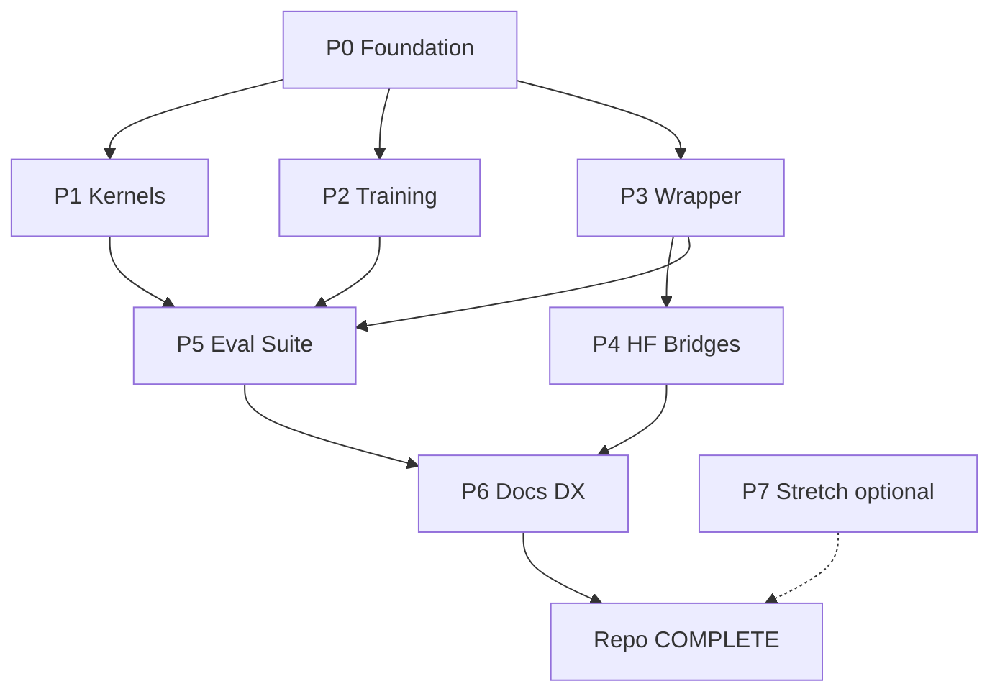
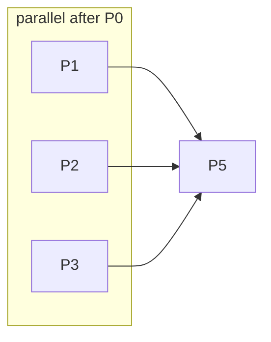

# E2E Roadmap — Complete Repository

**Canonical master plan** for finishing this repo relative to the perfected thesis.  
**Supersedes** the thin checklist in `docs/10_ROADMAP.md` (that file now points here).  
**Aligns with:** `docs/05`, `07`, `08`, `09`, `18`, `19`, `00`.

| Field | Value |
|-------|-------|
| Created | 2026-07-23 |
| Status | Active execution plan |
| Science gaps | **0 material OPEN** (`docs/09`, `docs/19`) — do not reopen as blockers |
| Thesis lock | Extreme low-bit **inference** on **CPU/edge** with **real** packed kernels |

---

## 0. Vision & definition of “repo complete”

### 0.1 Vision

Ship a **complete, installable, testable lab** that:

1. Trains Bi-Real / BinaryNet / BitLinear-style models honestly (STE simulation).
2. Runs **packed** 1-bit (and pedagogical 1.58-bit) inference on **CPU** with MSVC-native kernels.
3. Wraps existing `nn.Linear` stacks (hybrid FFN) without claiming magic PTQ quality.
4. Documents the **decision tree**: CPU BNN / bitnet.cpp vs GPU INT4/FP8 — never fake `sign()` speedups.
5. Automates eval (accuracy, speedup, compression, energy-proxy, robustness) with regression gates.

### 0.2 Done Definition (measurable acceptance)

A future agent may mark the repo **COMPLETE** only when **all** of the following hold:

| Gate | Criterion | Source / gate number |
|------|-----------|----------------------|
| **D1 Packaging** | `pip install -e .` works on Windows x64 + Python ≥3.11; `import bnn` exports public API | `pyproject.toml` |
| **D2 Native kernel** | `compile_native.py` builds DLL; `validate_native` max abs err **= 0** | existing |
| **D3 Kernel speed** | For N≥4096, native GEMM vs NumPy FP32 ≥ **2×** (regression: do not drop below 3.0× at 64×4096×4096 vs recorded 3.61× by >30%) | `results/benchmark.json` |
| **D4 Compression** | Binary pack assert **32.00×** ±0.01 | `export_check` |
| **D5 MNIST** | `binary_mlp` ≥95% when FP ≥97% in ≤5 epochs; gap ≤3 pp | `results/train_results.json` |
| **D6 CIFAR** | CIFAR-10 Bi-Real script runnable; documented proxy numbers exist; optional full-50k schedule documented | `results/cifar10_proxy.*` |
| **D7 Wrapper** | CLI `wrap` or script: replace Linears, report compression + gemm_only + e2e; skip stem/head | `bnn/wrapper.py` |
| **D8 Tests** | `pytest` ≥ unit+kernel+smoke; CI green on Windows (and ideally Linux) | `tests/`, `.github/workflows/` |
| **D9 Docs** | README → thesis, quickstart, E2E roadmap, decision tree; API stub or autodoc | this file + `docs/` |
| **D10 Eval harness** | One command regenerates SUMMARY from golden scripts without manual JSON editing | `scripts/run_eval_suite.py` |
| **D11 Non-goals honored** | No CUDA-BNN “32×” claims; GPU path docs point to torchao/AWQ/vLLM | ADR |
| **D12 Repro** | Pin deps; document MSVC vs MinGW; seed flags on train scripts | `requirements.txt` / lock |

**Optional stretch (not required for COMPLETE):** OpenMP/AVX kernels, ImageNet runner, FINN export, live bitnet.cpp submodule, RAPL meters.

### 0.3 “Complete” in one sentence

> **Installable `bnn` package + MSVC packed kernels + train/wrap/eval CLI + automated regression gates matching today’s measured evidence + docs that keep the thesis honest.**

---

## 1. Current state audit

### 1.1 Exists today (honest inventory)

| Area | Status | Paths |
|------|--------|-------|
| Research docs 00–20 | Done (science map closed) | `docs/` |
| STE + Binary/Ternary layers | Done | `bnn/ste.py`, `bnn/layers.py` |
| Models (MLP/CNN/Bi-Real) | Done | `bnn/models.py` |
| MNIST / CIFAR loaders (no torchvision) | Done | `bnn/data.py`, `bnn/cifar.py` |
| Packed binary GEMM (NumPy + MSVC DLL) | Done | `bnn/kernels/packed.py`, `binary_gemm.c`, `compile_native.py` |
| Ternary 2-bit pack (size pedagogy) | Done | `bnn/kernels/ternary_pack.py` |
| Linear wrap modes | Done | `bnn/wrapper.py` |
| Scripts: train, bench, validate, export, wrap, CIFAR, FGSM, energy, hybrid, ternary | Done | `scripts/` |
| Measured results | Done | `results/*.json` |
| Gap closure | Done | `docs/09`, `19` |

### 1.2 Missing for “repo complete” (engineering — not science reopen)

| Gap | Why it blocks COMPLETE | Phase |
|-----|------------------------|-------|
| No `pyproject.toml` / editable install | Not a real package | P0 |
| No `tests/` / pytest | Regressions silent | P0 |
| No CI | Windows/MSVC breaks unnoticed | P0 |
| No unified CLI | Agents/scripts scattered | P0/P3 |
| No golden regression runner | Manual re-bench | P5 |
| OpenMP/AVX | Optional polish (ADR non-goal) | P1 optional / P7 |
| Native ternary GEMM | Size-only today; speed = bitnet.cpp | P1 pedagogy / P4 bridge |
| HF tiny model demo | Demo is synthetic MLP | P4 |
| API reference / tutorials | Docs are research-heavy | P6 |
| `docs/10` stale checkboxes | Conflicts with reality | P0.T0 (this pass) |

### 1.3 Environment realities (do not ignore)

- **Windows + MSVC x64** for `_binary_gemm_native.dll` (MinGW 32-bit → WinError 193).
- PyTorch often **CPU-only** here → GPU BNN demos are non-goals; document INT4/FP8 instead.
- Python **3.14** may lack torchvision/numba → keep custom data loaders.
- CIFAR via HF `uoft-cs/cifar10` → `data/cifar10_hf/*.npz` preferred over slow Toronto tarball.

---

## 2. North-star architecture

### 2.1 Target package layout

```
Binary Neural Network/
├── pyproject.toml              # package metadata, entry points
├── ROADMAP.md                  # → docs/21
├── README.md
├── requirements.txt            # thin pin or generated from pyproject
├── .github/workflows/ci.yml
├── bnn/
│   ├── __init__.py             # stable public API
│   ├── ste.py
│   ├── layers.py
│   ├── models.py
│   ├── data.py
│   ├── cifar.py
│   ├── wrapper.py
│   ├── export.py               # NEW: pack/save/load checkpoints
│   ├── eval_report.py          # NEW: aggregate results → SUMMARY
│   ├── cli.py                  # NEW: `bnn` console script
│   └── kernels/
│       ├── packed.py
│       ├── ternary_pack.py
│       ├── ternary_gemm.py     # NEW optional: slow reference / future native
│       ├── binary_gemm.c
│       ├── compile_native.py
│       └── _binary_gemm_native.dll
├── scripts/                    # thin wrappers calling bnn.cli / library
├── tests/
│   ├── test_ste.py
│   ├── test_pack.py
│   ├── test_native_gemm.py
│   ├── test_wrapper.py
│   ├── test_models_smoke.py
│   └── conftest.py
├── docs/
│   ├── 21_E2E_ROADMAP_COMPLETE_REPO.md   # THIS FILE
│   ├── tutorials/              # NEW
│   └── api/                    # NEW stubs or mkdocs
├── results/                    # committed golden JSON (+ regenerated)
└── data/                       # gitignored bulk; README how to fetch
```

### 2.2 Public API (target)

```python
from bnn import (
    BinaryLinear, TernaryLinear, BinaryConv2d, BiRealBlock,
    binary_sign, ternary_weight, clip_weights_,
    build_model, wrap_linear_modules,
    pack_checkpoint, load_packed_linear,  # export.py
)
```

### 2.3 CLI (target)

```bat
bnn compile-native
bnn validate-native
bnn bench --shapes 64,4096,4096
bnn train --model binary_mlp --epochs 3
bnn train-cifar --subset 20000 --epochs 5
bnn wrap --mode binary_xnor --hidden 4096
bnn eval-suite --out results/SUMMARY.md
bnn energy-bound --wrap-json results/wrap_demo.json
```

### 2.4 Backends

| Backend | Role | Status target |
|---------|------|---------------|
| PyTorch CPU STE | Train / simulate | Keep |
| NumPy packed GEMM | Fallback | Keep |
| MSVC `__popcnt64` DLL | Production CPU binary | Keep + test |
| OpenMP/AVX DLL | Optional speed | Stretch |
| bitnet.cpp (external) | Ternary LLM serve | Guide + optional shim |
| torchao / vLLM | GPU INT4/FP8 | Docs only |

---

## 3. Phased E2E plan

Estimates: **S** ≤2h · **M** 2–8h · **L** 1–3d · **XL** >3d.  
Owner: **A** = Agent · **H** = Human (secrets, GPU machines, product calls).

---

### P0 — Foundation hardening

**Goal:** Installable, tested, reproducible base so later phases don’t rot.  
**Deps:** none. **Estimate:** L (~2–3d).

| ID | Task | Files | Est | Owner | Done when |
|----|------|-------|-----|-------|-----------|
| P0.T0 | Point `docs/10` + README + root `ROADMAP.md` at this master plan | `docs/10_ROADMAP.md`, `README.md`, `ROADMAP.md` | S | A | Links live |
| P0.T1 | Add `pyproject.toml` (`name=bnn`, packages, script entry `bnn=bnn.cli:main`) | `pyproject.toml` | M | A | `pip install -e .` works |
| P0.T2 | Implement minimal `bnn/cli.py` dispatching to existing scripts | `bnn/cli.py` | M | A | `bnn validate-native` runs |
| P0.T3 | Add `pytest` + `tests/conftest.py` (tmpdir, skip-if-no-DLL) | `tests/` | M | A | `pytest -q` collects |
| P0.T4 | Unit tests: STE sign/ternary, clip, pack round-trip binary | `tests/test_ste.py`, `tests/test_pack.py` | M | A | Pass |
| P0.T5 | Kernel correctness test: native vs ±1 FP (err=0) | `tests/test_native_gemm.py` | M | A | Pass or skip w/ reason |
| P0.T6 | Smoke: build_model forward all variants | `tests/test_models_smoke.py` | S | A | Pass |
| P0.T7 | Wrapper smoke: replace Linears, compression ≥30× | `tests/test_wrapper.py` | S | A | Pass |
| P0.T8 | GitHub Actions: Windows + MSVC compile + pytest | `.github/workflows/ci.yml` | L | A | Workflow green |
| P0.T9 | Optional Linux CI job: NumPy fallback only (no DLL) | same | M | A | Documented |
| P0.T10 | `.gitignore`: `data/*.tar.gz`, `__pycache__`, `*.dll` optional policy | `.gitignore` | S | A | Sensible |
| P0.T11 | Pin `requirements.txt` / extras `[dev]` with pytest | `pyproject.toml` | S | A | Dev install works |
| P0.T12 | Document Python 3.11–3.14 matrix in README | `README.md` | S | A | Note present |
| P0.T13 | Seed + `torch.set_num_threads` flags on train scripts | `scripts/train.py`, `train_cifar10_proxy.py` | S | A | Repro section |
| P0.T14 | `export_check` assert wired into pytest | `tests/test_export_check.py` | S | A | Compression gate |
| P0.T15 | Fix stale claims in `docs/04` (deps list) | `docs/04_ARCHITECTURE.md` | S | A | Matches reality |

**P0 acceptance:** D1, D2, D4, D8 (minimal), D12 partially.

**Risks:** MSVC not on CI runners → ship prebuild script + skip; document `compile_native.py` failure modes.

---

### P1 — Kernel productionization

**Goal:** Hardened binary kernels; ternary path clear; benches trustworthy.  
**Deps:** P0.T3–T5. **Estimate:** L–XL.

| ID | Task | Files | Est | Owner | Done when |
|----|------|-------|-----|-------|-----------|
| P1.T1 | Parametrized correctness suite (B,M,N incl. non-multiples of 64) | `tests/test_native_gemm.py` | M | A | Edge shapes pass |
| P1.T2 | Bench harness: JSON schema + machine metadata | `scripts/benchmark.py`, `bnn/eval_report.py` | M | A | Schema documented |
| P1.T3 | Regression gate vs golden `results/benchmark.json` (±30% floor) | `tests/test_bench_regression.py` | M | A | Fails on catastrophic slowdown |
| P1.T4 | Document pre-pack-once rule in bench + wrapper | `docs/06`, code comments | S | A | No re-pack footgun |
| P1.T5 | Optional: OpenMP parallel outer loop in `binary_gemm.c` | `bnn/kernels/binary_gemm.c` | L | A | **Optional** — ADR non-goal; only if product asks |
| P1.T6 | Optional: AVX2 popcount / 256-bit paths | same + compile flags | XL | A | Optional stretch |
| P1.T7 | Ternary pack fuzz tests (random shapes) | `tests/test_ternary_pack.py` | S | A | 0 roundtrip errors |
| P1.T8 | Ternary dequant GEMM reference + “not faster” assert in docs/test | `bnn/kernels/ternary_gemm.py` | M | A | Pedagogy clear |
| P1.T9 | DLL load diagnostics (arch mismatch message) | `bnn/kernels/packed.py` | S | A | Clear WinError 193 help |
| P1.T10 | `compile_native.py` exit codes + `--force` | `compile_native.py` | S | A | CI-friendly |
| P1.T11 | Microbench: pack overhead vs gemm_only split (already partially) | `scripts/wrap_existing_demo.py` | S | A | Metrics in JSON |
| P1.T12 | Thread affinity notes for fair bench (`OMP_NUM_THREADS`) | `docs/17`, README | S | A | Protocol |

**P1 acceptance:** D2, D3, D4 solid; optional T5/T6 not required for COMPLETE.

---

### P2 — Training stack

**Goal:** Training recipes production-shaped (still STE/sim); CIFAR path robust.  
**Deps:** P0. **Estimate:** L.

| ID | Task | Files | Est | Owner | Done when |
|----|------|-------|-----|-------|-----------|
| P2.T1 | Unify train CLI: `--model`, `--dataset mnist|cifar`, seeds | `bnn/cli.py`, scripts | M | A | One entry |
| P2.T2 | Checkpoint save/load latent weights + meta | `bnn/export.py` | M | A | Roundtrip train→load |
| P2.T3 | CIFAR full-50k schedule recipe doc + flag `--train-subset 0` | `docs/13`, script | S | A | Documented |
| P2.T4 | Longer CIFAR optional run (e.g. 20–50 ep) when agent has time | `results/cifar10_fullish.*` | L | A | Optional numbers |
| P2.T5 | ApproxSign / ReAct-style STE option behind flag | `bnn/ste.py`, `layers.py` | M | A | Flag works |
| P2.T6 | Distillation sketch: FP teacher → binary student CE+KD | `scripts/distill_sketch.py` | M | A | Toy MNIST runs |
| P2.T7 | Learning-rate schedule + weight clip logging | train scripts | S | A | History JSON |
| P2.T8 | Assert BN momentum 0.9 in models (test) | `tests/test_models_smoke.py` | S | A | Gate |
| P2.T9 | Ternary MLP train path already exists — add regression acc floor | `tests/test_train_smoke.py` | M | A | ≥90% in 1 ep smoke |
| P2.T10 | Document “training not faster” in CLI help | `bnn/cli.py` | S | A | Honest UX |

**P2 acceptance:** D5, D6; distill sketch present.

---

### P3 — Wrapper productization

**Goal:** Product-shaped wrap API for hybrid FFN / existing models.  
**Deps:** P0.T7. **Estimate:** L.

| ID | Task | Files | Est | Owner | Done when |
|----|------|-------|-----|-------|-----------|
| P3.T1 | `wrap_model(model, policy=HybridFFN|AllLargeLinear|…)` API | `bnn/wrapper.py` | M | A | Policies enum |
| P3.T2 | Merge hybrid demo into library (not only script) | `bnn/wrapper.py`, `hybrid_ffn_wrap_demo.py` | M | A | Importable |
| P3.T3 | Export packed weights to `.npz` / custom format | `bnn/export.py` | M | A | Load without FP copy |
| P3.T4 | CLI `bnn wrap` with report JSON | `bnn/cli.py` | M | A | Matches wrap_demo fields |
| P3.T5 | Cosine / MSE quality report vs FP (honest PTQ warning) | wrapper report | S | A | Printed |
| P3.T6 | Skip-list config file (YAML/JSON) | `configs/wrap_default.json` | S | A | Configurable |
| P3.T7 | BinaryConv2d wrap path (optional research) | `bnn/wrapper.py` | L | A | Optional |
| P3.T8 | Docs: when wrap is size-only vs speed | `docs/12` update | S | A | Clear matrix |

**P3 acceptance:** D7.

---

### P4 — HF / ecosystem bridges

**Goal:** Bridges without violating thesis (no fake GPU BNN).  
**Deps:** P3. **Estimate:** L.

| ID | Task | Files | Est | Owner | Done when |
|----|------|-------|-----|-------|-----------|
| P4.T1 | Tiny HF demo: load small `transformers` MLP/encoder, wrap FFN | `scripts/hf_tiny_wrap_demo.py` | L | A | Runs if HF installed |
| P4.T2 | Extra `[hf]` deps optional | `pyproject.toml` | S | A | Extra install |
| P4.T3 | Guide: HF → GGUF / llama.cpp (checklist) | `docs/22_HF_TO_GGUF_GUIDE.md` | M | A | Doc exists |
| P4.T4 | Guide: BitNet checkpoint → bitnet.cpp | `docs/23_BITNET_CPP_BRIDGE.md` | M | A | Doc exists |
| P4.T5 | Guide: GPU path torchao INT4/FP8 + vLLM (explicit non-BNN) | `docs/24_GPU_INT4_FP8_LANE.md` | M | A | Doc exists |
| P4.T6 | Thin shim script that prints recommended tool for a goal | `scripts/recommend_stack.py` | S | A | Uses decision tree |
| P4.T7 | Do **not** vendor bitnet.cpp; submodule optional note | docs | S | A | No giant submodule by default |
| P4.T8 | HF wrap: measure size only + warn cosine | demo JSON | M | A | Honest metrics |

**P4 acceptance:** Guides + optional HF demo; D11.

---

### P5 — Evaluation & reporting

**Goal:** One-button honesty.  
**Deps:** P0, existing results. **Estimate:** M–L.

| ID | Task | Files | Est | Owner | Done when |
|----|------|-------|-----|-------|-----------|
| P5.T1 | `bnn eval-suite` orchestrates validate→bench→train-smoke→wrap→energy→fgsm | `scripts/run_eval_suite.py`, `bnn/cli.py` | L | A | One command |
| P5.T2 | Regenerate `results/SUMMARY.md` from JSON | `bnn/eval_report.py` | M | A | Deterministic MD |
| P5.T3 | Golden floors table in `tests/golden_floors.json` | `tests/` | S | A | Used by tests |
| P5.T4 | CIFAR proxy included as optional `--full` | eval suite | S | A | Flag |
| P5.T5 | Robustness script wired; floors on drop_pp documented | `robustness_fgsm.py` | S | A | In suite |
| P5.T6 | Energy bound wired | `energy_bound_measured.py` | S | A | In suite |
| P5.T7 | Machine card: CPU model, torch version, threads | eval JSON | S | A | Metadata |
| P5.T8 | Fail CI if compression ≠32× or err≠0 | CI + tests | M | A | Gate |

**P5 acceptance:** D10; D3/D4/D5 automated.

---

### P6 — Docs & DX

**Goal:** Newcomers and agents execute without archaeology.  
**Deps:** P0–P5 partially. **Estimate:** M–L.

| ID | Task | Files | Est | Owner | Done when |
|----|------|-------|-----|-------|-----------|
| P6.T1 | Tutorial: 15-min MNIST binary train + bench | `docs/tutorials/01_mnist_binary.md` | M | A | Steps work |
| P6.T2 | Tutorial: wrap existing MLP | `docs/tutorials/02_wrap_linear.md` | M | A | Steps work |
| P6.T3 | Tutorial: CIFAR Bi-Real proxy | `docs/tutorials/03_cifar_bireal.md` | M | A | Steps work |
| P6.T4 | API reference stub (module list + key functions) | `docs/api/README.md` | M | A | Linked from README |
| P6.T5 | Update `docs/18` status table to match this roadmap | `docs/18_...` | S | A | No conflict |
| P6.T6 | Decision-tree printable one-pager | `docs/18` or `docs/25_ONEPAGER.md` | S | A | Exists |
| P6.T7 | CONTRIBUTING.md: how agents update §10 checkboxes | `CONTRIBUTING.md` | S | A | Protocol |
| P6.T8 | Changelog | `CHANGELOG.md` | S | A | Started |
| P6.T9 | MkDocs or just Markdown — prefer Markdown keep-it-simple | — | S | H/A | Decision recorded |
| P6.T10 | Fix dimension map / README inventory of docs 21+ | `docs/00`, README | S | A | Indexed |

**P6 acceptance:** D9.

---

### P7 — Optional stretch (not required for COMPLETE)

**Goal:** Nice-to-haves; never block Done Definition.  
**Deps:** product ask. **Estimate:** XL aggregate.

| ID | Task | Files | Est | Owner | Notes |
|----|------|-------|-----|-------|-------|
| P7.T1 | OpenMP binary GEMM | `binary_gemm.c` | L | A | ADR optional uplift |
| P7.T2 | ImageNet protocol runner (download + recipe, not full train) | `scripts/imagenet_protocol.md` + stub | M | A | Non-goal train |
| P7.T3 | FINN/Brevitas export notes | `docs/26_FINN_NOTES.md` | M | A | Doc only |
| P7.T4 | Mobile: LCE / ExecuTorch checklist | `docs/27_MOBILE_EXPORT.md` | M | A | Doc |
| P7.T5 | RAPL / Windows powercfg experiment if tooling appears | scripts | L | H/A | Proxy already closed |
| P7.T6 | ARM NEON CI (self-hosted) | CI | XL | H | Hardware |
| P7.T7 | Native ternary matmul (research) | C kernel | XL | A | Prefer bitnet.cpp |
| P7.T8 | Canvas / dashboard for results | optional | L | A | UX only |

---

## 4. Dependency graph





---

## 5. Workstreams that can run in parallel

| After | Stream A (Agent) | Stream B (Agent) | Stream C (Agent) |
|-------|------------------|------------------|------------------|
| Start | P0.T1–T3 packaging/CLI | P0.T10–T12 gitignore/docs | — |
| P0.T3 done | P0.T4–T7 tests | P0.T8 CI | P0.T13–T15 polish |
| P0 done | **P1** kernels+tests | **P2** train/CIFAR/distill | **P3** wrapper policies |
| Mid | P1.T7–T8 ternary | P2.T6 distill | P3.T3 export |
| P3 done | **P4** HF guides | **P5** eval-suite | P6 tutorials draft |
| Near end | P5 golden floors | P6 API + CONTRIBUTING | Human: review D11 claims |

**Rule:** Never parallelize two agents editing the same file (`wrapper.py`, `cli.py`, `packed.py`) without a merge plan.

---

## 6. Milestone checklist

| Milestone | Ship criteria | Maps to |
|-----------|---------------|---------|
| **M0** | Roadmap canonical; pointers fixed | P0.T0 |
| **M1** | Editable install + pytest green locally | P0 |
| **M2** | CI Windows (or documented MSVC path) | P0.T8 |
| **M3** | Kernel regression gates | P1.T1–T3 |
| **M4** | Train+CIFAR CLI unified; checkpoints | P2 |
| **M5** | Wrapper product API + CLI | P3 |
| **M6** | Eval suite regenerates SUMMARY | P5 |
| **M7** | Tutorials + API stub + decision one-pager | P6 |
| **M8 COMPLETE** | All Done Definition gates D1–D12 | §0.2 |
| **M9 Stretch** | Any P7 item | optional |

---

## 7. Test & verification matrix

| After phase | Must run | Golden / floor |
|-------------|----------|----------------|
| P0 | `pytest`, `compile_native`, `validate_native` | err=0; compress 32× |
| P1 | `benchmark.py` | ≥2× @ N≥4096; prefer retain ≥3.0× @ 4096 vs NumPy |
| P2 | `train.py --epochs 3` | binary_mlp ≥95%; gap ≤3 pp vs FP |
| P2 | `train_cifar10_proxy` smoke | Completes; writes JSON |
| P3 | `wrap_existing_demo` | compression ≈32×; gemm_only >1× if native |
| P4 | HF demo or skip-if-no-extra | No crash; honest cosine |
| P5 | `eval-suite` | SUMMARY matches floors |
| P6 | Manual tutorial walkthrough | 15-min path works |
| Any | Grep for “32× faster” unqualified | Must not appear as claim |

### Golden anchors (from this machine — update if re-benched)

| Metric | Value | File |
|--------|------:|------|
| Pack compression | 32.00× | `results/benchmark.json` |
| S @ 64×4096×4096 vs NumPy | 3.61× | same |
| S @ 32×8192×8192 vs NumPy | 9.29× | same |
| MNIST binary_mlp | 96.36% | `train_results.json` |
| CIFAR proxy gap | 11.15 pp | `cifar10_proxy.json` |
| Wrap e2e speedup | ~1.67× | `wrap_demo.json` |
| Energy latency-only | ~1.67× | `energy_bound.json` |

---

## 8. Non-goals / out of scope (locked)

From ADR + gap register — **executors must not sprawl here** unless ADR amended:

| Non-goal | Why |
|----------|-----|
| CUDA classic BNN beating Tensor Cores | Industry: use INT4/FP8 |
| Claim training speedup from binarization | STE keeps FP latents |
| Full ImageNet Bi-Real as COMPLETE gate | ACCEPTED-NON-GOAL (G23) |
| OpenMP/AVX as COMPLETE gate | ACCEPTED-NON-GOAL (G11); optional P7/P1.T5 |
| Board RAPL as COMPLETE gate | CLOSED-BY-PROXY energy |
| Stock NPU native 1-bit | Vendor INT8-first (`docs/20`) |
| Replace vLLM / ship production BitNet pretrain | Point to bitnet.cpp / HF |
| Fake `sign()` marketing | Forever forbidden |

---

## 9. Execution protocol for agents

### 9.1 Pick next task

1. Open **§10 Progress tracker** below; find first unchecked task whose deps are done.
2. Prefer **P0 → parallel P1/P2/P3 → P5 → P6**; P4 after P3; P7 only on request.
3. Do **not** reopen science gaps in `docs/09` as blockers — engineering only.

### 9.2 Per-task Definition of Done

- [ ] Code/docs paths listed in the task row touched
- [ ] Acceptance test for that task run (or skip documented)
- [ ] Checkbox in §10 marked `[x]` with date in PR/commit message when human commits
- [ ] No new unqualified “32× faster” claims
- [ ] If thesis tension → stop and update ADR first

### 9.3 Progress updates

- Update §10 checkboxes in `docs/21_E2E_ROADMAP_COMPLETE_REPO.md` when a task lands.
- Append one line to `CHANGELOG.md` (once created) under Unreleased.
- Keep `docs/10_ROADMAP.md` as pointer only — **do not** resurrect a second conflicting checklist.

### 9.4 Suggested PR granularity

- One phase subsection or 3–8 task IDs per PR.
- Never mix OpenMP stretch with packaging P0 in the same PR.

---

## 10. Progress tracker

Mark `[x]` when done. **Status 2026-07-23 completion pass: required P0–P6 DONE; P7 optional left open.**

### P0 Foundation

- [x] **P0.T0** Canonical roadmap pointers
- [x] **P0.T1** `pyproject.toml` editable install
- [x] **P0.T2** `bnn/cli.py` entry points
- [x] **P0.T3** pytest scaffold
- [x] **P0.T4** STE/pack unit tests
- [x] **P0.T5** Native GEMM correctness tests
- [x] **P0.T6** Model smoke tests
- [x] **P0.T7** Wrapper smoke tests
- [x] **P0.T8** GitHub Actions Windows CI
- [x] **P0.T9** Linux NumPy-fallback CI job
- [x] **P0.T10** `.gitignore` hygiene
- [x] **P0.T11** Dev extras / pins
- [x] **P0.T12** Python version matrix in README
- [x] **P0.T13** Seed/thread flags on train scripts
- [x] **P0.T14** export_check in pytest
- [x] **P0.T15** Refresh `docs/04` deps/architecture map

### P1 Kernels

- [x] Core MSVC binary GEMM + validate (pre-roadmap)
- [x] Ternary 2-bit pack demo (pre-roadmap)
- [x] **P1.T1** Edge-shape correctness suite
- [x] **P1.T2** Bench JSON schema + machine metadata (eval_report machine card)
- [x] **P1.T3** Bench regression vs golden
- [x] **P1.T4** Pre-pack documentation pass
- [ ] **P1.T5** OpenMP (optional — ACCEPTED-NON-GOAL)
- [ ] **P1.T6** AVX2 (optional — ACCEPTED-NON-GOAL)
- [x] **P1.T7** Ternary pack fuzz tests
- [x] **P1.T8** Ternary reference GEMM module
- [x] **P1.T9** DLL diagnostics
- [x] **P1.T10** compile_native CI exits (`--force`)
- [x] **P1.T11** Pack vs gemm_only metrics audit (wrap demo)
- [x] **P1.T12** Thread protocol notes (README / train `--threads`)

### P2 Training

- [x] STE layers, Bi-Real, MNIST train (pre-roadmap)
- [x] CIFAR-10 proxy script + results (pre-roadmap)
- [x] Hybrid FFN STE sketch script (pre-roadmap)
- [x] **P2.T1** Unified train CLI (`bnn train` / `train-cifar`)
- [x] **P2.T2** Checkpoint export/load (`bnn/export.py`)
- [x] **P2.T3** Full CIFAR recipe docs (`docs/13` + tutorial 03)
- [ ] **P2.T4** Longer CIFAR optional run (optional; proxy already exists)
- [ ] **P2.T5** ApproxSign/ReAct STE flag (optional polish)
- [x] **P2.T6** Distill sketch script
- [x] **P2.T7** Schedules + clip logging (train history JSON)
- [x] **P2.T8** BN momentum test gate
- [x] **P2.T9** Train smoke / MNIST floors in golden tests
- [x] **P2.T10** Honest CLI help on train speed

### P3 Wrapper

- [x] `wrap_linear_modules` + demos (pre-roadmap)
- [x] **P3.T1** Wrap policies API (`wrap_model`)
- [x] **P3.T2** Library hybrid FFN (allowlist)
- [x] **P3.T3** Packed export format
- [x] **P3.T4** `bnn wrap` CLI
- [x] **P3.T5** Quality report fields (cosine in wrap_demo)
- [x] **P3.T6** Skip-list config (`configs/wrap_default.json`)
- [ ] **P3.T7** BinaryConv wrap (optional)
- [x] **P3.T8** docs/12 refresh (existing + tutorials)

### P4 Bridges

- [x] Decision tree + NPU INT8 docs (pre-roadmap)
- [x] **P4.T1** HF tiny wrap demo
- [x] **P4.T2** `[hf]` extra
- [x] **P4.T3** GGUF guide doc
- [x] **P4.T4** bitnet.cpp bridge doc
- [x] **P4.T5** GPU INT4/FP8 lane doc
- [x] **P4.T6** `recommend_stack.py` / `bnn recommend`
- [x] **P4.T7** No default submodule policy
- [x] **P4.T8** HF honest metrics/warning

### P5 Eval

- [x] Individual result JSONs (pre-roadmap)
- [x] **P5.T1** `eval-suite` orchestrator
- [x] **P5.T2** SUMMARY regenerator
- [x] **P5.T3** `golden_floors.json`
- [x] **P5.T4** CIFAR optional in suite (`--full`)
- [x] **P5.T5** FGSM results wired into SUMMARY
- [x] **P5.T6** Energy in suite
- [x] **P5.T7** Machine card metadata
- [x] **P5.T8** CI gates on compress/err (pytest + export_check)

### P6 Docs / DX

- [x] Research docs 00–20 (pre-roadmap)
- [x] This E2E roadmap (P0.T0)
- [x] **P6.T1** MNIST tutorial
- [x] **P6.T2** Wrap tutorial
- [x] **P6.T3** CIFAR tutorial
- [x] **P6.T4** API stub
- [x] **P6.T5** Sync docs/18
- [x] **P6.T6** One-pager
- [x] **P6.T7** CONTRIBUTING
- [x] **P6.T8** CHANGELOG
- [x] **P6.T9** Docs tooling decision (Markdown keep-it-simple)
- [x] **P6.T10** Index docs 21+ in README

### P7 Stretch

- [ ] **P7.T1**–**P7.T8** optional (not required for COMPLETE)

### Completion

- [x] Done Definition D1–D12 — see `docs/22_COMPLETION_REPORT.md`

---

## Appendix A — Task count summary (post-completion)

| Phase | Required remaining | Notes |
|-------|-------------------|--------|
| P0–P6 | **0** | COMPLETE |
| P1.T5–T6 / P2.T4–T5 / P3.T7 | optional | Not blocking |
| P7 | all optional | Stretch only |

## Appendix B — Verify in 5 commands

```bat
pip install -e ".[dev]"
python -m bnn.kernels.compile_native
pytest -q
bnn export-check & bnn validate-native
bnn eval-suite --skip-pytest
```

---

*End of master E2E roadmap. Repo COMPLETE per D1–D12 (`docs/22_COMPLETION_REPORT.md`).*
