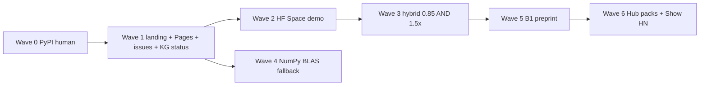

# Transformation plan — exponential, not polish

| Field | Value |
|-------|-------|
| **Status** | Living post-v1 product plan (WC gates stay in `ROADMAP.md` / `docs/37`). **2026-08-15:** Waves 0–1 shipped. Wave H: issue #2 CLI epilog, Larq/§8, KG overlay, NumPy BLAS (PRs #34–#37). Wave S: `demo/space/` in-repo (PR #38, **Space not live** — HF Pro 402); `wrap_demo` AND-gate (PR #39). Ultra TinyBlock hybrid still ~0.70 `REFUSE`. Hub packs / B1 submit **unclaimed**. |
| **Date** | 2026-08-13 (integrator refresh 2026-08-15) |
| **HEAD at writing** | `a03c5b4` (`main` after wrap AND-gate `#39`) |
| **Tag** | `v1.0.0` (2026-08-04) |
| **Package** | `bnn-lab` (import/CLI `bnn`) |
| **Thesis lock** | Packed CPU/edge XNOR–popcount + honest STE; **32× is uint64 pack compression, not GPU from `sign()`**; no invented goldens |

Canonical product plan remains [`ROADMAP.md`](../ROADMAP.md). This file answers a different question: *what would 10× this lab as a public repo in 2026, from first principles, given the lab is already “complete”?*

Related: [`45_IMPROVEMENT_ROADMAP_HANDOFF.md`](45_IMPROVEMENT_ROADMAP_HANDOFF.md) (measured leftovers), [`MOONSHOT_DEFERRALS.md`](MOONSHOT_DEFERRALS.md), [`PUBLICATION_PLAN.md`](PUBLICATION_PLAN.md), [`knowledge_graph/VIEW.md`](../knowledge_graph/VIEW.md).

---

## A. Current state (1 screen)

Audit: **2026-08-13** (integrator refresh **2026-08-15** vs `a03c5b4`). Score is honesty vs a *public category-leading repo*, not vs the lab’s own WC gates (those are largely green).

| Area | Score | State | Residual |
|------|------:|-------|----------|
| **Kernels** | **9/10** | Portable SIMD (AVX-512 → AVX2 → NEON → scalar), OpenMP, `err = 0` bit-identity, 4-row blocking. Aggregate **5.1×** vs prior kernel; **~24×** vs NumPy FP32 at 64×4096×4096. When native is **absent**, large-B dispatch uses dequant+BLAS (`docs/45` P1, PR #37). | Typical Win/mac pip wheels already ship native SIMD. `binary_gemm_numpy_prepacked` stays the `err = 0` reference. 32× is pack size, not GPU from `sign()`. |
| **Wrap / WC-O** | **8/10** | `bnn optimise` + schema v1, auto policy, BN fuse, distill, drop-in **REFUSE**. **`wrap_demo` hidden=4096 AND-gate shipped** (PR #39): cosine **0.999**, e2e **2.65×**, `forced: false`. Default `--policy auto` on Ultra TinyBlock still **hybrid cosine ~0.70** + `REFUSE_DROP_IN`. Ternary+QAT cosine **0.991**, drop-in OK — but e2e **0.73×** (does **not** count). WC-O4 is **[x]**. | Residual is TinyBlock hybrid still below 0.85 — not “QAT is a sketch,” and not a live-everywhere drop-in claim. |
| **Codec** | **8/10** | `.bnnpack` v2 + hashes + safetensors. | ONNX = bridge-only (policy). No Hub collection of packs. |
| **CLI** | **8/10** | Rich (`optimise`, `repro`, `bridge`, `kg`, `energy-bound`, …). Issue **#2 closed** (epilog inventory, PR #34). | Clone-first; `bnn/cli.py` ~1k lines (split is 1.1×). |
| **Docs** | **9/10** | `GUIDE_E2E`, tutorials 01–08, MkDocs autodoc `--strict`, dual-metric pip-first README, **GitHub Pages live**, issue **#1 closed**, Larq-vacuum competitor table (PR #35). In-repo Gradio wrap paradox (`demo/space/`, PR #38). | **Space not live** (HF Pro 402). No Hub packs / B1 submit. |
| **CI / OSS** | **8/10** | Win+Linux native, py3.11–3.13, portability, CodeQL, OpenSSF Scorecard, LICENSE, templates, Discussions, branch protection, **Pages deployed**. Issue **#2 closed**. | **0 stars / 0 forks**. Dependabot hygiene. |
| **Research / KG** | **7/10** | 168 nodes / 296 edges, `validate PASS`, claims whitelist, B1–B3 vault, 2026 literature overlay (PR #36). | No venue submit. Intentional OpenGaps stay open (`gap_litespark_local`, `gap_venue_submit`, `gap_reactnet_in_repo`, `gap_fbi_llm_repro`). |
| **Moonshots** | **8/10** | WASM pedagogy, RAPL proxy, ImageNet *protocol* (no SOTA gate), bitnet.cpp pin (no submodule). | Privileged RAPL, ORT custom op, BitDistill-scale KD — correctly deferred. |
| **PyPI** | **8/10** | `bnn-lab` **1.0.0** on PyPI (OIDC Trusted Publisher, 2026-08-14). | Recurring releases; no Windows ARM64 / no `cp313-win_amd64` in 1.0.0. Name `bnn` taken by Adrian Bulat. |

**Headline:** this is a **world-class *lab*** (repro, kernels, honesty) with **v1.0 WC gates + PyPI + Pages** shipped. Wave H/S in-repo: NumPy BLAS fallback, `wrap_demo` AND-gate, `demo/space/` (not live). The *exponential* gap left is **live** conversion (HF Space / Hub packs), B1 cite, TinyBlock hybrid still ~0.70 `REFUSE`, and category occupancy after **Larq archived 2026-06-15**. No GPU 32× from `sign()`.

### Remaining ROADMAP `[ ]` / `[~]` (honest)

| Item | Kind |
|------|------|
| W8.T08 / WC-R2–R4 | **Shipped 2026-08-14:** `bnn-lab` 1.0.0 on PyPI (OIDC) |
| v1.0 checklist rows in §8 | **Aligned 2026-08-15:** WC gates, launch checklist, README badges, `v1.0.0` tag, PyPI all `[x]`. Wrap AND-gate is **not** a §8 row. `wrap_demo` AND-gate **shipped** (PR #39); Ultra TinyBlock hybrid still unclaimed. |
| Wave H / S in-repo | **Shipped 2026-08-15:** PRs #34–#39. Space **not live**. Hub packs / B1 submit unclaimed. |
| W6.T05 seq reverse-task card | **`[x]`** — `docs/DATASET_CARDS.md` |
| Ternary kernels / audio / ONNX / leaderboard `[~]` | Polish or deferred-by-policy, not blockers |
| Non-goals in §0.3 | Stay `[ ]` forever (GPU 32×, ImageNet SOTA gate, Whisper product, NPU 1-bit) |

### Inventory snapshot

- **Git:** `main` @ `a03c5b4` after PRs #32–#39 (PyPI, landing, Wave H/S). Issue #1 and #2 closed. Pages live. Space **not live**.
- **Release:** `v1.0.0` 2026-08-04; **`bnn-lab` 1.0.0** on PyPI 2026-08-14 (OIDC). Frozen `v1.0.0` tag has no attached wheel assets (wheels live in Actions / PyPI).
- **KG OpenGaps still `open`:** `gap_venue_submit`, `gap_reactnet_in_repo`, `gap_litespark_local`, `gap_fbi_llm_repro`. **`gap_pypi_trusted` merged** 2026-08-14. 2026 literature overlay shipped (PR #36).

---

## B. First-principles bottlenecks

### What the actual product is

A **lab that proves packed binary/ternary GEMM + honest wrap** for CPU/edge:

1. uint64 pack compression is **exactly 32×** (size).
2. Inference speed comes from **XNOR–popcount kernels**, not `sign()` + `nn.Linear`.
3. STE trains latents; packed kernels infer.
4. Reports **dual metrics** and **refuses** drop-in when cosine is junk.
5. When BitNet/INT4/FP8/GGUF wins, **`bnn bridge` says so**.

It is **not** a fake-binary GPU story, not llama.cpp, not bitnet.cpp, not ImageNet SOTA.

### Rate-limiting constraints (why they dominate)

| # | Constraint | Why it dominates |
|---|------------|------------------|
| **1. Discoverability / install physics** | A stranger **can** `pip install bnn-lab==1.0.0` (library). Search for “binary neural networks pytorch” still hits archived Larq, Adrian Bulat’s `bnn` 0.1.2, and student MNIST repos — **not this lab**. 0 stars after a complete v1.0. | OSS “best in category” is a **funnel**. Indexable install is shipped; category occupancy and conversion remain the gap. |
| **2. Wrap quality vs speed (Amdahl + STE)** | Default `bnn optimise --policy auto` on Ultra TinyBlock: **hybrid cosine ~0.70**, e2e modest, `REFUSE_DROP_IN`. Committed `wrap_demo.json` (hidden=4096, QAT 200 steps): cosine **0.999** / **2.65×** e2e, `forced: false` (PR #39). Ternary+QAT: cosine **0.991**, e2e **0.73×**. | The remaining 10× product gap is **TinyBlock hybrid ≥0.85 cosine and still ≥1.5× e2e**. Auto already refuses honestly. Ternary already meets cosine and **loses** wall-clock. `wrap_demo` Sequential AND-gate is **shipped** — do not retarget a new bench. |
| **3. Memory bandwidth vs popcount throughput** | Large GEMMs are DRAM-bound; packing wins by shrinking the stream. Small GEMMs / Python loops / act-pack overhead eat Amdahl. When native is **absent**, batched packed NumPy **used to** lose to BLAS; PR #37 dispatches dequant+BLAS above a batch cutoff (`docs/45` P1). | Physics: 32× fewer bytes only helps if the runtime **streams packed bits**. Typical pip (Win/mac wheels) already loads native SIMD. The fallback is for failed/`BNN_FORCE_NUMPY`/exotic platform, not “most `pip install` users.” |
| **4. STE / architecture gap vs literature** | Lab CIFAR Bi-Real **61% vs FP 71%** (10 pp). Literature ImageNet ladder: BinaryNet 42% → ReActNet-A **69.4%**. RSign/RPReLU is documented, not default (`gap_reactnet_in_repo`). | Training recipe, not kernel, sets whether wrap/train is a toy. Closing 10 pp on the **canary** is allowed; ImageNet SOTA as a **gate** is not. |
| **5. OSS trust / conversion** | Pip-first README + above-the-fold When-NOT (**issue #1 closed** 2026-08-13). MkDocs **Pages live**. In-repo Space app (`demo/space/`, PR #38); **not live** on Hugging Face (Pro 402). KG 2026 overlay shipped (PR #36). | llama.cpp / bitnet.cpp / transformers still win on **60-second try-before-clone**. Residual is a **public** Space, not clone+MSVC or Pages 404. |
| **6. Category confusion (BitNet era)** | 2026 mindshare is **1.58-bit LLMs** (bitnet.cpp **~40k★**, 2B4T, BitEmbed, ScaleQ-1.58 PTQ, Litespark SIMD). Classic CNN BNN tooling (**Larq archived**) is vacant. | Competing with bitnet.cpp on LLM tok/s is suicide. Occupying **PyTorch packed BNN optimiser + honest routing** is the wedge. |

### Invert: what world-class looks like in 2026

| Class | DX bar this lab should steal (not copy the product) |
|-------|------------------------------------------------------|
| **llama.cpp** | One install → tokens/sec. GGUF on the Hub. Hardware matrix. |
| **bitnet.cpp** | Official kernels + HF artifacts + “when this is the tool”. |
| **transformers / bitsandbytes / torchao / AWQ** | `pip install` + 5-line snippet + Hub integration + docs site. |
| **Starship** | Instant first prompt; no tribal knowledge. |
| **Larq (while alive)** | JOSS paper, zoo, compute engine, `pip install larq`. |

**Target shape:** `pip install bnn-lab` → 60s dual-metric report → Hub `.bnnpack` → Pages docs → paper from goldens → bridge to bitnet.cpp/INT4 when they win.

---

## C. Exponential levers (top 10, ranked)

Each item: **what / why 10× not 1.1× / first principles / evidence / effort / thesis risk / next PR**.

**Kind (rank order unchanged):** **funnel 10×** = adoption/discoverability (levers **1–3, 6–8**) — not a measured kernel/wrap ratio. **Measured 10×** = wall-clock or cosine on committed shapes (levers **4, 5**). Lever 9 is agent-memory; lever 10 is bounded/bridge.

### 1. Ship `bnn-lab` on PyPI (Trusted Publisher) — *funnel 10×* — **SHIPPED 2026-08-14**

- **What:** Pending publisher for `bnn-lab` / `wheels.yml` / env `pypi`; dispatch `publish=true` on **`main`**; clean-venv `pip install bnn-lab==1.0.0` + `import bnn`. (`bnn repro` remains clone + `[dev]`.)
- **Why 10×:** Converts the lab from “clone a 3-week-old repo” to **the installable PyTorch BNN toolkit** the week Larq is archived. Zero → indexable on PyPI, Cursor, pip, HF snippets.
- **First principles:** Distribution is the scarce resource, not another SIMD path.
- **Evidence:** `docs/PYPI_PUBLISH.md`; KG `gap_pypi_trusted` **merged**; PyPI name `bnn` taken; run [31825286443](https://github.com/KanakMalpani/Binary-Neural-Networks/actions/runs/31825286443).
- **Effort:** **S** (human, ~30 min) + **S** post-upload README (`pip install bnn-lab` first).
- **Thesis risk:** **None** if dual-metric README stays.
- **Next PR:** This docs/ROADMAP/KG flip (W8.T08 `[x]`). Recurring releases stay OIDC-only.

### 2. Landing conversion: 60-second dual-metric demo, not clone+MSVC — *funnel 10×* — **SHIPPED 2026-08-13**

- **What:** README above-the-fold = one-liner install + one command that prints **compression 32×, cosine, wall-clock, REFUSE/OK**. Thesis mermaid sits under the thesis. Issue **#1 implemented** as an above-the-fold “When NOT to use BNN” callout under the thesis (GPU/INT4/bitnet.cpp/NPU INT8) and **closed**. **GitHub Pages** deploys from MkDocs CI to [kanakmalpani.github.io/Binary-Neural-Networks](https://kanakmalpani.github.io/Binary-Neural-Networks/).
- **Why 10×:** llama.cpp/HF conversion is “first screen success.”
- **First principles:** Attention is bandwidth-limited; the README is the only kernel most visitors run.
- **Evidence:** PR [#32](https://github.com/KanakMalpani/Binary-Neural-Networks/pull/32); issue [#1](https://github.com/KanakMalpani/Binary-Neural-Networks/issues/1) closed 2026-08-13; Pages HTML 200.
- **Effort:** **M** (done).
- **Thesis risk:** **Low** — dual-metric warnings stayed.
- **Next PR:** none for this lever. Residual conversion is lever 3 (HF Space).

### 3. One killer demo (HF Space): the wrap paradox, visualized — *funnel 10×* — **SHIPPED in-repo 2026-08-15** (not live)

- **What:** A Space (KanakMalpani) that runs `bnn optimise` on a **tiny public** MLP/CNN: three columns — FP32, binary packed, ternary+QAT — showing **size / cosine / latency** and the REFUSE badge. Not ImageNet. Not ASR. In-repo: `demo/space/` (PR #38). **Not live:** Hugging Face Gradio `cpu-basic` returns HTTP 402 without Pro.
- **Why 10×:** bitnet.cpp has an Azure demo; transformers has Spaces. A 0-star repo with no try-before-clone cannot enter the category. The *unique* demo is honesty (binary/hybrid fast-ish + below drop-in vs ternary accurate + slower), which no fake-32× repo will ship.
- **First principles:** Product = decision under constraints. Show the Pareto, don’t hide it.
- **Evidence:** `demo/space/`; `results/ultra_wrap.json` hybrid cosine ~0.70 / `drop_in_ok: false`; ternary 0.991 cosine / 0.73× e2e; committed `results/wrap_demo.json` is now the QAT AND-gate (0.999 / 2.65×, PR #39) — the Space README still labels the **pre-QAT** 0.31 snapshot separately.
- **Effort:** **L** (CPU Space, no GPU claim).
- **Thesis risk:** **Medium** if the Space implies drop-in; mitigate with the same schema flags. 32× is pack size, not GPU from `sign()`.
- **Next PR:** human create public Space after Hugging Face Pro. Do **not** claim a live Space until it exists.

### 4. Wrap accuracy leap: hybrid/binary ≥0.85 **and** e2e ≥1.5× — *measured 10×* — **SHIPPED on `wrap_demo` 2026-08-15**

- **What:** One public recipe on **committed** `wrap_demo` / `ultra_wrap` shapes (not a new golden): **binary or hybrid** wrap + short QAT/distill reaches cosine **≥0.85 and** e2e **≥1.5×** vs FP, **without `--force`**. Ternary already has cosine **0.991** and e2e **0.73×** — that does **not** satisfy this lever.
- **Shipped (PR #39):** `results/wrap_demo.json` hidden=4096 layers 3+5, 200-step MSE STE QAT + packed `binary_xnor`: cosine **0.999**, e2e **2.65×**, `drop_in_ok: true`, `forced: false`. Floors on **that same shape**.
- **Still unclaimed:** Ultra TinyBlock hybrid (`ultra_wrap` primary) cosine **~0.70**, e2e **~1.61×**, `REFUSE`. Do **not** lower the AND-gate; do **not** invent a new bench; do **not** count ternary 0.73× e2e.
- **1.1× fallback (not this lever):** make `policy=auto` never first-run a `REFUSE_DROP_IN` path. Default auto **already** lands hybrid cosine **~0.70** + REFUSE on TinyBlock.
- **Why 10×:** This is the product. Crossing **both** gates on one honest demo changes “lab” → “tool” for that shape. TinyBlock hybrid remaining REFUSE is the leftover.
- **First principles:** STE mismatch + absmean PTQ wipe (`paper_bitdistill` vs `method_absmean_ptq`). BitDistill-scale KD is a moonshot; a **short, reproducible QAT** on the existing demo is the lever.
- **Evidence:** WC-O4 `[x]`; `wrap_demo` AND-gate `[x]` on hidden=4096; `ultra_wrap` primary still below 0.85. 32× is pack compression, not GPU from `sign()`.
- **Effort:** **L** (done for `wrap_demo`).
- **Thesis risk:** **High** if someone “fixes” TinyBlock cosine by changing golden **shapes**. Stay on committed wrap_demo / ultra_wrap / CIFAR canary.
- **Next PR:** none for `wrap_demo`. Do not wait on this lever for Hub/B1 docs. Optional later: TinyBlock hybrid — spike first, fail-closed.

### 5. Honest NumPy fallback: never slower than “doing nothing” — *measured 10×* — **SHIPPED 2026-08-15**

- **What:** When **native does not load**, dispatch packed NumPy vs dequant+BLAS by shape (docs/45 P1). Keep `binary_gemm_numpy_prepacked` as the **correctness reference**. README: *correct* ≠ *fast*.
- **Why 10× (for that audience):** Without a native library, batched packed NumPy was **5–11× slower than FP32 BLAS**. That inverted the thesis for the no-native-load path. Typical `pip install` on Win/mac already ships native SIMD.
- **First principles:** Bandwidth win requires a packed *or* BLAS-fast path; a Python loop over B is neither.
- **Evidence:** PR #37; `tests/test_numpy_blas_fallback.py`; measured table in docs/45; crossover B≈8 at 4096.
- **Effort:** **M** (done).
- **Thesis risk:** **Low** if `err = 0` both ways and compression of stored weights is unchanged. 32× pack size is untouched.
- **Next PR:** none for P1. Optional: README one-liner still says this release does not auto-dispatch — that sentence is now stale (H2-owned README; follow-up).

### 6. Occupy the Larq vacuum, explicitly — *funnel 10×* — **SHIPPED 2026-08-15** (copy)

- **What:** Positioning sentence: *PyTorch packed BNN optimiser now that Larq (TF/Keras) is archived (2026-06-15).* Comparison table: Larq / Brevitas / bitnet.cpp / torchao / this lab. Do **not** claim LCE FPS or GPU 32×.
- **Why 10×:** Category leadership is **who inherits the search query**. 732★ Larq is read-only; LCE last release 2024. PyTorch users have no default BNN toolkit with packed kernels + honesty.
- **First principles:** Markets have one default. Vacancy is a larger delta than another tutorial.
- **Evidence:** larq/larq archived 2026-06-15; README + `docs/02_SOTA_SURVEY.md` competitor table.
- **Effort:** **S–M** (done for in-repo copy). Show HN / blog remain human.
- **Thesis risk:** **Low** — we don’t claim Larq Zoo ImageNet numbers as ours.
- **Next PR:** none for in-repo copy. Optional later: Show HN with an honest title.

### 7. B1 tech report from goldens + Papers with Code — *funnel 10×*

- **What:** Ship **B1 — Stop claiming 32×** as an arXiv tech report **only** from `results/*.json` + claims whitelist (`docs/PUBLICATION_PLAN.md`). Register the repo on Papers with Code / CITATION.cff already exists. B2/B3 as companions later.
- **Why 10×:** Academic and HN funnels are paper-shaped. A citable “honest speedup accounting” paper is the unique research wedge (not another XNOR-Net survey). Citations compound; more CIFAR epochs do not.
- **First principles:** The scarce claim is *measurement culture*, which the lab already has.
- **Evidence:** `paper_b1_honest_speedup blocked_by gap_venue_submit`; fake-binary ~1.4× slower in committed benches; dual-metric schema.
- **Effort:** **L** (author time; LaTeX outside this repo OK).
- **Thesis risk:** **High** if the paper advertises 32× latency. Whitelist C1–C7 only.
- **Next PR:** `docs(W12): B1 preprint skeleton + PwC code link` (no invented figures).

### 8. Hub artifacts: `.bnnpack` + tiny zoo on Hugging Face — *funnel 10×*

- **What:** Upload 1–3 **tiny** packed artifacts (MNIST MLP, CIFAR Bi-Real canary weights if license-clean, wrap-demo pack) with model cards that quote floors, not SOTA. `from_pretrained`-style load in tutorial 08.
- **Why 10×:** llama.cpp won because GGUF is a **noun** on the Hub. `.bnnpack` is a format without a public object. Formats without objects don’t get copied.
- **First principles:** A codec is a product only if strangers can download a file.
- **Evidence:** W5.T03–T06 done in-tree; no HF collection; bitnet.cpp ships `BitNet-b1.58-2B-4T-gguf`.
- **Effort:** **M**.
- **Thesis risk:** **Low** if cards say canary, not ImageNet.
- **Next PR:** `feat(W5): HF collection + bnnpack model card`.

### 9. KG freshness + agent-facing honesty (compounding for AI users) — **SHIPPED 2026-08-15**

- **What:** Flip stale `open_pr` → `merged` / `closed_by_policy`; add 2026 nodes (ScaleQ-1.58 `2608.01078`, BitEmbed `2606.25674`, VibeASR-BitNet `2607.21075`, Litespark `2605.06485`) as **literature-only**. CI already validates structure; add “status vs ROADMAP” drift test.
- **Why ~5–10× for agents, 1.1× for humans:** This repo markets itself to coding agents (`AGENTS.md`). A graph that says Wave 1 is still open **after v1.0.0** trains agents to reimplement shipped work (R9).
- **First principles:** The KG is the lab’s memory; stale memory is a silent failure.
- **Evidence:** PR #36; `bnn kg` 168/296 PASS; `meta.lab_coverage_note` current after PyPI 1.0.0; literature overlay only — **do not invent** Litespark numbers.
- **Effort:** **M** (done).
- **Thesis risk:** **None** if unreproduced Litespark numbers stay `OpenGap`.
- **Next PR:** none for overlay. Venue submit stays human (`gap_venue_submit`).

### 10. Kernel leap that stays thesis-honest (bounded)

- **What (pick one, not all):** (a) **Ternary 4-row blocking** — docs/45 P2, only ~1.1–1.5× on small B; (b) **optional T-MAC/LUT path** for BitNet-shaped ternary GEMMs, dual-metric vs current bitplane kernel, **no Litespark number copying**; (c) a **scripted bitnet.cpp 2B4T run** via `bnn bridge` that prints tok/s from *their* kernels.
- **Why it can 10× *a user metric*:** (c) is the honest 10× for “CPU 1-bit LLM” — because the physics lives in bitnet.cpp. (a) is 1.1×. (b) is research, high variance.
- **First principles:** Don’t spend kernel years on a 1.1× when the LLM user should be routed. Do spend kernel years on **this lab’s** wide binary GEMM remaining competitive with BLAS on *published shapes*.
- **Evidence:** bitnet.cpp Jan 2026 +1.15–2.1×; Litespark claims 18×/96× vs *naive PyTorch* (different baseline — **gap_litespark_local**); lab 64×4096 already ~24× vs NumPy FP32.
- **Effort:** (a) **M**, (b) **XL**, (c) **M**.
- **Thesis risk:** **High** for (b) if README quotes unreproduced 96×. **None** for (c) if clearly a bridge.
- **Next PR:** Prefer **(c)** `docs(W4): bitnet.cpp 2B4T smoke recipe` then **(a)** only if a user needs small-batch ternary.

---

## D. Explicit non-goals / anti-levers

Impressive-looking work that **violates the thesis** or **does not compound**:

| Anti-lever | Why not |
|------------|---------|
| GPU 32× from `sign()` / STE | Forbidden forever. |
| Invented golden shapes / Litespark local benches copied from the paper | R9; `gap_litespark_local` stays literature. |
| Full ImageNet SOTA as a **gate** | Non-goal. Protocol runner already exists. |
| Production Whisper / ASR | Audio lane is synthetic; BitNet-ASR papers are **their** stack (`2607.21075`). |
| Stock phone NPU native 1-bit | Vendors ship INT8/INT4 (`docs/20`). |
| Full BitNet pretrain / FBI-LLM repro in this repo | Bridge; `gap_fbi_llm_repro`. |
| ORT custom op | Closed-by-policy; revisit only with demand. |
| Memory arena | Measured 1.4–1.8% + aliasing (`docs/43`). |
| `ruff format` whole-repo / CLI split / more tutorials 09–20 | 1.1× maintainability, merge pain. |
| Competing with bitnet.cpp on tok/s using this GEMM | Wrong product; route. |
| Dependabot firehose as the roadmap | Hygiene, not 10×. |
| Paperwork-close of issue #1 | **Closed 2026-08-13** after the above-the-fold callout landed (PR #32). Do not reopen as paperwork. |
| Counting ternary 0.991 / 0.73× e2e, or auto-REFUSE, as Wave 3 | Ternary already meets cosine and loses speed; auto already refuses. The 10× is hybrid/binary **0.85 and 1.5×**. |
| WASM as a native-kernel substitute | Pedagogy only. |

**Moonshots allowed as labeled moonshots (not gates):** LUT ternary ASIC/T-MAC research, privileged RAPL Joules, community leaderboard submissions, ReActNet-A ImageNet *reproduction* if someone brings the schedule and hardware.

---

## E. 90-day sequence (waves, compounding)

Do **not** open 20 parallel lanes. Wave 2 already proved integration cost. Prefer: **PyPI → landing → killer demo → wrap accuracy → kernel honesty**.

| Wave | Days | Owner | Exit | Depends |
|------|------|-------|------|---------|
| **0** | 0–3 | **Human** | `pip install bnn-lab==1.0.0` + `import bnn` on clean venv; PyPI JSON 200 | **Shipped 2026-08-14** |
| **1** | 1–14 | Agent | Pip-first README; Pages live; **issue #1 implemented** as an above-the-fold “When NOT to use BNN” callout under the thesis (then close); KG `open_pr` drift | **Shipped 2026-08-13** (PR [#32](https://github.com/KanakMalpani/Binary-Neural-Networks/pull/32); issue #1 closed; Pages live). KG overlay **shipped** PR #36. |
| **2** | 7–28 | Agent | HF Space shows wrap paradox on **existing** shapes (label auto ~0.70 REFUSE vs `wrap_demo` QAT win) | **In-repo shipped 2026-08-15** (PR #38, `demo/space/`). **Not live** — HF Pro 402. |
| **3** | 14–45 | Agent | **Same as lever 4 (AND, not OR):** hybrid/binary cosine **≥0.85 and** e2e **≥1.5×** on committed `wrap_demo` / `ultra_wrap` shapes, without `--force`. Ternary 0.991 / 0.73× does **not** count. | **`wrap_demo` hidden=4096 shipped** (PR #39: 0.999 / 2.65×). Ultra TinyBlock hybrid still ~0.70 `REFUSE`. |
| **4** | 21–45 | Agent | When native is **absent**, NumPy fallback never 5× slower than BLAS at B=64 (docs/45 P1). Typical Win/mac pip wheels already have native SIMD. | **Shipped 2026-08-15** (PR #37). Independent of 3. |
| **5** | 30–75 | Author | B1 arXiv from goldens; PwC code link | **Unclaimed.** Waves 1–2 (public artifact). |
| **6** | 45–90 | Mixed | HF `.bnnpack` collection; Show HN / r/MachineLearning with **honest** title. In-repo Larq-vacuum copy **shipped 2026-08-15**. | **Hub packs unclaimed.** Waves 0–2. |

**Optional after day 60 (not on the critical path):** ReActNet RSign/RPReLU in `bnn.ste` as a CIFAR canary improvement (`gap_reactnet_in_repo`); ternary row-blocking (P2); bitnet.cpp 2B4T bridge smoke.

**Success metric for “best public repo in category” (90 days), not stars-as-vanity:**

1. `pip install bnn-lab` works.
2. A stranger gets a dual-metric report in <5 minutes without MSVC.
3. One Hub or Space artifact exists. (**Partial:** in-repo `demo/space/`; **no live Space**, no Hub packs.)
4. Hybrid/binary wrap on a committed shape is **drop-in (≥0.85) and faster (≥1.5× e2e)** — **`wrap_demo` hidden=4096 yes**; Ultra TinyBlock hybrid still `REFUSE`. Honest skip/REFUSE is already shipped and is **not** this bar. Ternary 0.73× e2e does **not** count.
5. Paper or tech report cites committed goldens only. (**Unclaimed** — no B1 arXiv submit.)
6. Search “pytorch binary neural network packed” can find this repo.

Stars follow those; they are not the input.

---

## Lab vs literature lag (KG + 2026 papers)

**This lab is ahead on:** dual-metric culture, fake-binary negative control, `err = 0` multi-ISA kernels, repro gates, wrap REFUSE, bridges CLI, energy-proxy honesty, agent-oriented docs.

**This lab is behind / not claiming:**

| Topic | SOTA (literature) | Lab stance |
|-------|-------------------|------------|
| 1.58-bit LLMs | BitNet b1.58, 2B4T, bitnet.cpp GPU+CPU, BitEmbed, VibeASR-BitNet | **Bridge only** |
| Ternary PTQ of existing LLMs | ScaleQ-1.58 / AYOT (Aug 2026) | Not claimed; absmean PTQ wipe documented |
| Extreme SIMD ternary | Litespark 18–96× vs naive PT | **OpenGap** — do not invent |
| Vision 1-bit ImageNet | ReActNet ~69–71% | CIFAR canary 61%; RSign not default |
| Training STE | SURGE (ICML 2026), ApproxSign, EDE | Clipped STE default; math compare JSON |
| Classic BNN DX | Larq archived | **Vacancy to occupy** |
| GPU datacenter | AWQ / GPTQ / torchao / FP8 | Bridge |

---

## Proposal vs ROADMAP

- Do **not** treat this file as a new WC gate.
- Do **not** invent benches or flip §10 boxes here.
- When a wave ships, update ROADMAP twins **in that PR**.
- If a wave conflicts with a WC gate, **WC gate wins**.
- Wrap AND-gate (Wave 3 / lever 4): **`wrap_demo` hidden=4096 shipped** (PR #39 — cosine **0.999** and e2e **2.65×** without `--force`). Ultra TinyBlock hybrid still ~0.70 `REFUSE`. Ternary 0.991 / 0.73× e2e does **not** count. Not a WC reopen. 32× is uint64 pack compression, not GPU from `sign()`.
