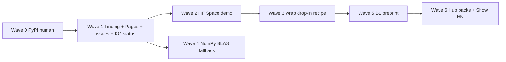

# Transformation plan — exponential, not polish

| Field | Value |
|-------|-------|
| **Status** | Proposal (does **not** flip `ROADMAP.md` / `docs/37` checkboxes) |
| **Date** | 2026-08-13 |
| **HEAD at writing** | `bc4aa7e` (`v1.0.0-3-gbc4aa7e`) |
| **Tag** | `v1.0.0` (2026-08-04) |
| **Package** | `bnn-lab` (import/CLI `bnn`) |
| **Thesis lock** | Packed CPU/edge XNOR–popcount + honest STE; **32× is uint64 pack compression, not GPU from `sign()`**; no invented goldens |

Canonical product plan remains [`ROADMAP.md`](../ROADMAP.md). This file answers a different question: *what would 10× this lab as a public repo in 2026, from first principles, given the lab is already “complete”?*

Related: [`45_IMPROVEMENT_ROADMAP_HANDOFF.md`](45_IMPROVEMENT_ROADMAP_HANDOFF.md) (measured leftovers), [`MOONSHOT_DEFERRALS.md`](MOONSHOT_DEFERRALS.md), [`PUBLICATION_PLAN.md`](PUBLICATION_PLAN.md), [`knowledge_graph/VIEW.md`](../knowledge_graph/VIEW.md).

---

## A. Current state (1 screen)

Audit: **2026-08-13**. Score is honesty vs a *public category-leading repo*, not vs the lab’s own WC gates (those are largely green).

| Area | Score | State | Residual |
|------|------:|-------|----------|
| **Kernels** | **9/10** | Portable SIMD (AVX-512 → AVX2 → NEON → scalar), OpenMP, `err = 0` bit-identity, 4-row blocking. Aggregate **5.1×** vs prior kernel; **~24×** vs NumPy FP32 at 64×4096×4096. | NumPy fallback is **5–11× slower than BLAS** for B≳8 ([docs/45](45_IMPROVEMENT_ROADMAP_HANDOFF.md) P1). Wheels often `BNN_NO_OPENMP=1`. |
| **Wrap / WC-O** | **7/10** | `bnn optimise` + schema v1, auto policy, BN fuse, distill sketch, drop-in **REFUSE**. Binary wrap cosine **0.31** (demo) / **0.70** (hybrid) — not drop-in. Ternary+QAT cosine **0.99**, drop-in OK — but e2e **0.73×** (slower than FP). | Product paradox: fast path destroys quality; accurate path loses wall-clock. |
| **Codec** | **8/10** | `.bnnpack` v2 + hashes + safetensors. | ONNX = bridge-only (policy). No Hub collection of packs. |
| **CLI** | **8/10** | Rich (`optimise`, `repro`, `bridge`, `kg`, `energy-bound`, …). | Clone-first; `bnn/cli.py` ~1k lines (split is 1.1×). |
| **Docs** | **8/10** | `GUIDE_E2E`, tutorials 01–08, MkDocs autodoc `--strict`, dual-metric README. | **GitHub Pages 404**. README conversion is clone+MSVC. Issue #1 still open though README already has “When not to use”. |
| **CI / OSS** | **7/10** | Win+Linux native, py3.11–3.13, portability, CodeQL, OpenSSF Scorecard, LICENSE, templates, Discussions, branch protection. | **0 stars / 0 forks**. 2 stale good-first issues. 7+ Dependabot PRs. No Pages. |
| **Research / KG** | **7/10** | 165 nodes / 288 edges, `validate PASS`, claims whitelist, B1–B3 vault. | KG still marks Wave 1 lanes as `open_pr` after merge #26. No venue submit. Survey last reviewed 2026-08-04 (misses ScaleQ-1.58, BitEmbed, VibeASR-BitNet). |
| **Moonshots** | **8/10** | WASM pedagogy, RAPL proxy, ImageNet *protocol* (no SOTA gate), bitnet.cpp pin (no submodule). | Privileged RAPL, ORT custom op, BitDistill-scale KD — correctly deferred. |
| **PyPI** | **2/10** | `wheels.yml` + OIDC + attestations ready. | **`bnn-lab` not on PyPI** (human Trusted Publisher). Badge is a 404. Name `bnn` taken by Adrian Bulat. |

**Headline:** this is a **world-class *lab*** (repro, kernels, honesty) that is **not yet a public product**. The WC bar in ROADMAP §1 is mostly met; the *exponential* gap is distribution, conversion, wrap quality, and category occupancy after **Larq archived 2026-06-15**.

### Remaining ROADMAP `[ ]` / `[~]` (honest)

| Item | Kind |
|------|------|
| W8.T08 / WC-R2–R4 `[~]` | **Human:** PyPI Trusted Publisher + first upload |
| v1.0 checklist rows in §8 | Stale vs tagged `v1.0.0` — tag exists; PyPI line still open |
| Ternary kernels / audio / ONNX / leaderboard `[~]` | Polish or deferred-by-policy, not blockers |
| Non-goals in §0.3 | Stay `[ ]` forever (GPU 32×, ImageNet SOTA gate, Whisper product, NPU 1-bit) |

### Inventory snapshot

- **Git:** `main` = `bc4aa7e` (3 commits after `v1.0.0` / Wave 2 integrator `49de25b`: packing 2.5–10×, handoff doc, popcount signedness test).
- **Release:** `v1.0.0` 2026-08-04, **no attached wheel assets** (wheels live in Actions, unpublished).
- **KG OpenGaps still `open`:** `gap_pypi_trusted`, `gap_venue_submit`, `gap_reactnet_in_repo`, `gap_litespark_local`, `gap_fbi_llm_repro`. Several `open_pr` gaps are **stale** (WASM, bnnpack v2, distill, RAPL, layer search, bitnet submodule — shipped or closed-by-policy).

---

## B. First-principles bottlenecks

### What the actual product is

A **lab that proves packed binary/ternary GEMM + honest wrap** for CPU/edge:

1. uint64 pack compression is **exactly 32×** (size).
2. Inference speed comes from **XNOR–popcount kernels**, not `sign()` + `nn.Linear`.
3. STE trains latents; packed kernels infer.
4. Reports **dual metrics** and **refuses** drop-in when cosine is junk.
5. When BitNet/INT4/FP8/GGUF wins, **`bnn bridge` says so**.

It is **not** a fake-binary GPU story, not llama.cpp, not bitnet.cpp, not ImageNet SOTA.

### Rate-limiting constraints (why they dominate)

| # | Constraint | Why it dominates |
|---|------------|------------------|
| **1. Discoverability / install physics** | A stranger cannot `pip install bnn-lab`. Search for “binary neural networks pytorch” hits archived Larq, Adrian Bulat’s `bnn` 0.1.2, and student MNIST repos — **not this lab**. 0 stars after a complete v1.0. | OSS “best in category” is a **funnel**. Uninstallable + unfindable = zero compounding, regardless of kernel quality. |
| **2. Wrap quality vs speed (Amdahl + STE)** | Binary wrap: **~5× e2e** at cosine **0.31**. Ternary+QAT: cosine **0.99**, e2e **0.73×**. Auto policy `REFUSE_DROP_IN_CLAIM`. | Users who try the product verb (`bnn optimise`) on a real net either get a refused claim or a slower model. That is a **bounce**, not a 1.1× docs issue. |
| **3. Memory bandwidth vs popcount throughput** | Large GEMMs are DRAM-bound; packing wins by shrinking the stream. Small GEMMs / Python loops / act-pack overhead eat Amdahl. NumPy packed path **loses to BLAS** for batched shapes. | Physics: 32× fewer bytes only helps if the runtime **streams packed bits**. Fake-binary and slow fallback invert the thesis for the users without a compiler. |
| **4. STE / architecture gap vs literature** | Lab CIFAR Bi-Real **61% vs FP 71%** (10 pp). Literature ImageNet ladder: BinaryNet 42% → ReActNet-A **69.4%**. RSign/RPReLU is documented, not default (`gap_reactnet_in_repo`). | Training recipe, not kernel, sets whether wrap/train is a toy. Closing 10 pp on the **canary** is allowed; ImageNet SOTA as a **gate** is not. |
| **5. OSS trust / conversion** | README’s first action is `git clone` + `compile_native`. MkDocs builds in CI; **Pages not deployed**. HF Space: none. Issues #1–#2 stale. KG `open_pr` after merge. | llama.cpp / bitnet.cpp / transformers win on **60-second success**. This lab currently onboards like a research archive. |
| **6. Category confusion (BitNet era)** | 2026 mindshare is **1.58-bit LLMs** (bitnet.cpp **~40k★**, 2B4T, BitEmbed, ScaleQ-1.58 PTQ, Litespark SIMD). Classic CNN BNN tooling (**Larq archived**) is vacant. | Competing with bitnet.cpp on LLM tok/s is suicide. Occupying **PyTorch packed BNN optimiser + honest routing** is the wedge. |

### Invert: what world-class looks like in 2026

| Class | DX bar this lab should steal (not copy the product) |
|-------|------------------------------------------------------|
| **llama.cpp** | One install → tokens/sec. GGUF on the Hub. Hardware matrix. |
| **bitnet.cpp** | Official kernels + HF artifacts + “when this is the tool”. |
| **transformers / bitsandbytes / torchao / AWQ** | `pip install` + 5-line snippet + Hub integration + docs site. |
| **Starship** | Instant first prompt; no tribal knowledge. |
| **Larq (while alive)** | JOSS paper, zoo, compute engine, `pip install larq`. |

**Target shape:** `pip install bnn-lab` → 60s dual-metric report → Hub `.bnnpack` → Pages docs → paper from goldens → bridge to bitnet.cpp/INT4 when they win.

---

## C. Exponential levers (top 10, ranked)

Each item: **what / why 10× not 1.1× / first principles / evidence / effort / thesis risk / next PR**.

### 1. Ship `bnn-lab` on PyPI (Trusted Publisher)

- **What:** Human registers pending publisher for `bnn-lab` / `wheels.yml` / env `pypi`; dispatch `publish=true`; clean-venv `pip install bnn-lab && bnn repro`.
- **Why 10×:** Converts the lab from “clone a 3-week-old repo” to **the installable PyTorch BNN toolkit** the week Larq is archived. Zero → indexable on PyPI, Cursor, pip, HF snippets.
- **First principles:** Distribution is the scarce resource, not another SIMD path.
- **Evidence:** `docs/PYPI_PUBLISH.md`; KG `gap_pypi_trusted` + `world_class_v1 blocked_by` it; PyPI name `bnn` taken; wheels workflow already attested.
- **Effort:** **S** (human, ~30 min) + **S** post-upload README (`pip install bnn-lab` first).
- **Thesis risk:** **None** if dual-metric README stays.
- **Next PR:** After upload: README/GUIDE lead with pip; pin release assets; close W8.T08 in ROADMAP twins.

### 2. Landing conversion: 60-second dual-metric demo, not clone+MSVC

- **What:** README above-the-fold = one-liner install + one command that prints **compression 32×, cosine, wall-clock, REFUSE/OK**. Move thesis mermaid down. Close or rewrite stale issues #1–#2. Deploy **GitHub Pages** from existing MkDocs CI artifact.
- **Why 10×:** llama.cpp/HF conversion is “first screen success.” Current first screen is a research manifesto. Pages 404 wastes a `--strict` docs job.
- **First principles:** Attention is bandwidth-limited; the README is the only kernel most visitors run.
- **Evidence:** Exa fetch of GitHub README; `gh api .../pages` 404; issue #1 open while README already has “When not to use”.
- **Effort:** **M**.
- **Thesis risk:** **Low** — do not drop dual-metric warnings to look punchier.
- **Next PR:** `docs(W9): pip-first README + Pages workflow`; close #1 as completed.

### 3. One killer demo (HF Space): the wrap paradox, visualized

- **What:** A Space (KanakMalpani) that runs `bnn optimise` on a **tiny public** MLP/CNN: three columns — FP32, binary packed, ternary+QAT — showing **size / cosine / latency** and the REFUSE badge. Not ImageNet. Not ASR.
- **Why 10×:** bitnet.cpp has an Azure demo; transformers has Spaces. A 0-star repo with no try-before-clone cannot enter the category. The *unique* demo is honesty (binary fast+ugly vs ternary accurate+slower), which no fake-32× repo will ship.
- **First principles:** Product = decision under constraints. Show the Pareto, don’t hide it.
- **Evidence:** `results/wrap_demo.json` cosine 0.31 / 4.82× e2e; `results/ultra_wrap.json` ternary 0.99 cosine / 0.73× e2e; HF Spaces search for `bnn-lab` empty.
- **Effort:** **L** (CPU Space, no GPU claim).
- **Thesis risk:** **Medium** if the Space implies drop-in; mitigate with the same schema flags.
- **Next PR:** `feat(demo): Gradio Space from wrap_demo shapes only`.

### 4. Wrap accuracy leap on a *documented* tiny model (cross 0.85 without `--force`)

- **What:** One public recipe (not a new golden shape) where **binary or hybrid** wrap + short QAT/distill meets `drop_in_threshold` **and** stays ≥1.5× on the wide GEMM. If physics forbids it, make **`policy=auto` default to ternary/skip** so first-run is not `REFUSE` + cosine 0.3.
- **Why 10×:** This is the product. A kernel that is 24× on a microbench is irrelevant if `optimise` produces garbage logits. Crossing drop-in on *one* honest demo changes “lab” → “tool.”
- **First principles:** STE mismatch + absmean PTQ wipe (`paper_bitdistill` vs `method_absmean_ptq`). BitDistill-scale KD is a moonshot; a **short, reproducible QAT** on the existing demo is the lever. Literature: ReActNet/Bi-Real recover accuracy via **architecture + distill**, not magically via `sign()`.
- **Evidence:** WC-O4 exists as a sketch; ultra wrap `drop_in_ok: false` on binary hybrid; BitNet Distillation arXiv:2510.13998; ScaleQ-1.58 arXiv:2608.01078 (PTQ of reasoning LLMs — **do not claim** we reproduce it).
- **Effort:** **L**.
- **Thesis risk:** **High** if someone “fixes” cosine by changing golden shapes or claiming LLM chat quality. Stay on committed wrap demo / CIFAR canary.
- **Next PR:** `feat(W3): QAT recipe that meets drop-in on wrap_demo without --force` + docs/42 update. No new benches.

### 5. Honest NumPy fallback: never slower than “doing nothing”

- **What:** When native is absent, dispatch packed NumPy vs dequant+BLAS by shape (docs/45 P1). Keep `binary_gemm_numpy_prepacked` as the **correctness reference**. README: *correct* ≠ *fast*.
- **Why 10×:** Compiler-less users (pip wheel without native, or failed `cl`) currently run a path **5–11× slower than FP32 BLAS**. That inverts the thesis for the majority install. Fixing it is not 1.1× polish; it stops the product from lying by omission.
- **First principles:** Bandwidth win requires a packed *or* BLAS-fast path; a Python loop over B is neither.
- **Evidence:** Measured table in docs/45; crossover B≈8–16 at 4096.
- **Effort:** **M**.
- **Thesis risk:** **Low** if `err = 0` both ways and compression of stored weights is unchanged.
- **Next PR:** `perf(kernels): BLAS fallback when NumPy packed loses` + test at B=64.

### 6. Occupy the Larq vacuum, explicitly

- **What:** Positioning sentence: *PyTorch packed BNN optimiser now that Larq (TF/Keras) is archived (2026-06-15).* Comparison table: Larq / Brevitas / bitnet.cpp / torchao / this lab. Do **not** claim LCE FPS.
- **Why 10×:** Category leadership is **who inherits the search query**. 732★ Larq is read-only; LCE last release 2024. PyTorch users have no default BNN toolkit with packed kernels + honesty.
- **First principles:** Markets have one default. Vacancy is a larger delta than another tutorial.
- **Evidence:** larq/larq archived; docs/02 already notes it; Tavily/Exa did not surface this GitHub repo for generic BNN queries.
- **Effort:** **S–M** (README + `docs/02` row + maybe a blog/Show HN).
- **Thesis risk:** **Low** if we don’t claim Larq Zoo ImageNet numbers as ours.
- **Next PR:** `docs: Larq-archive positioning + competitor table`.

### 7. B1 tech report from goldens + Papers with Code

- **What:** Ship **B1 — Stop claiming 32×** as an arXiv tech report **only** from `results/*.json` + claims whitelist (`docs/PUBLICATION_PLAN.md`). Register the repo on Papers with Code / CITATION.cff already exists. B2/B3 as companions later.
- **Why 10×:** Academic and HN funnels are paper-shaped. A citable “honest speedup accounting” paper is the unique research wedge (not another XNOR-Net survey). Citations compound; more CIFAR epochs do not.
- **First principles:** The scarce claim is *measurement culture*, which the lab already has.
- **Evidence:** `paper_b1_honest_speedup blocked_by gap_venue_submit`; fake-binary ~1.4× slower in committed benches; dual-metric schema.
- **Effort:** **L** (author time; LaTeX outside this repo OK).
- **Thesis risk:** **High** if the paper advertises 32× latency. Whitelist C1–C7 only.
- **Next PR:** `docs(W12): B1 preprint skeleton + PwC code link` (no invented figures).

### 8. Hub artifacts: `.bnnpack` + tiny zoo on Hugging Face

- **What:** Upload 1–3 **tiny** packed artifacts (MNIST MLP, CIFAR Bi-Real canary weights if license-clean, wrap-demo pack) with model cards that quote floors, not SOTA. `from_pretrained`-style load in tutorial 08.
- **Why 10×:** llama.cpp won because GGUF is a **noun** on the Hub. `.bnnpack` is a format without a public object. Formats without objects don’t get copied.
- **First principles:** A codec is a product only if strangers can download a file.
- **Evidence:** W5.T03–T06 done in-tree; no HF collection; bitnet.cpp ships `BitNet-b1.58-2B-4T-gguf`.
- **Effort:** **M**.
- **Thesis risk:** **Low** if cards say canary, not ImageNet.
- **Next PR:** `feat(W5): HF collection + bnnpack model card`.

### 9. KG freshness + agent-facing honesty (compounding for AI users)

- **What:** Flip stale `open_pr` → `merged` / `closed_by_policy`; add 2026 nodes (ScaleQ-1.58 `2608.01078`, BitEmbed `2606.25674`, VibeASR-BitNet `2607.21075`, Litespark `2605.06485`) as **literature-only**. CI already validates structure; add “status vs ROADMAP” drift test.
- **Why ~5–10× for agents, 1.1× for humans:** This repo markets itself to coding agents (`AGENTS.md`). A graph that says Wave 1 is still open **after v1.0.0** trains agents to reimplement shipped work (R9).
- **First principles:** The KG is the lab’s memory; stale memory is a silent failure.
- **Evidence:** `bnn kg` 165/288 PASS; meta `lab_coverage_note` still “Wave 1 lanes A–I remain open PRs”; VIEW.md §8 still lists distill / bnnpack v2 as v1 leftovers.
- **Effort:** **M**.
- **Thesis risk:** **None** if unreproduced Litespark numbers stay `OpenGap`.
- **Next PR:** `chore(kg): post-v1.0.0 status + 2026 literature overlay`.

### 10. Kernel leap that stays thesis-honest (bounded)

- **What (pick one, not all):** (a) **Ternary 4-row blocking** — docs/45 P2, only ~1.1–1.5× on small B; (b) **optional T-MAC/LUT path** for BitNet-shaped ternary GEMMs, dual-metric vs current bitplane kernel, **no Litespark number copying**; (c) a **scripted bitnet.cpp 2B4T run** via `bnn bridge` that prints tok/s from *their* kernels.
- **Why it can 10× *a user metric*:** (c) is the honest 10× for “CPU 1-bit LLM” — because the physics lives in bitnet.cpp. (a) is 1.1×. (b) is research, high variance.
- **First principles:** Don’t spend kernel years on a 1.1× when the LLM user should be routed. Do spend kernel years on **this lab’s** wide binary GEMM remaining competitive with BLAS on *published shapes*.
- **Evidence:** bitnet.cpp Jan 2026 +1.15–2.1×; Litespark claims 18×/96× vs *naive PyTorch* (different baseline — **gap_litespark_local**); lab 64×4096 already ~24× vs NumPy FP32.
- **Effort:** (a) **M**, (b) **XL**, (c) **M**.
- **Thesis risk:** **High** for (b) if README quotes unreproduced 96×. **None** for (c) if clearly a bridge.
- **Next PR:** Prefer **(c)** `docs(W4): bitnet.cpp 2B4T smoke recipe` then **(a)** only if a user needs small-batch ternary.

---

## D. Explicit non-goals / anti-levers

Impressive-looking work that **violates the thesis** or **does not compound**:

| Anti-lever | Why not |
|------------|---------|
| GPU 32× from `sign()` / STE | Forbidden forever. |
| Invented golden shapes / Litespark local benches copied from the paper | R9; `gap_litespark_local` stays literature. |
| Full ImageNet SOTA as a **gate** | Non-goal. Protocol runner already exists. |
| Production Whisper / ASR | Audio lane is synthetic; BitNet-ASR papers are **their** stack (`2607.21075`). |
| Stock phone NPU native 1-bit | Vendors ship INT8/INT4 (`docs/20`). |
| Full BitNet pretrain / FBI-LLM repro in this repo | Bridge; `gap_fbi_llm_repro`. |
| ORT custom op | Closed-by-policy; revisit only with demand. |
| Memory arena | Measured 1.4–1.8% + aliasing (`docs/43`). |
| `ruff format` whole-repo / CLI split / more tutorials 09–20 | 1.1× maintainability, merge pain. |
| Competing with bitnet.cpp on tok/s using this GEMM | Wrong product; route. |
| Dependabot firehose as the roadmap | Hygiene, not 10×. |
| WASM as a native-kernel substitute | Pedagogy only. |

**Moonshots allowed as labeled moonshots (not gates):** LUT ternary ASIC/T-MAC research, privileged RAPL Joules, community leaderboard submissions, ReActNet-A ImageNet *reproduction* if someone brings the schedule and hardware.

---

## E. 90-day sequence (waves, compounding)

Do **not** open 20 parallel lanes. Wave 2 already proved integration cost. Prefer: **PyPI → landing → killer demo → wrap accuracy → kernel honesty**.

| Wave | Days | Owner | Exit | Depends |
|------|------|-------|------|---------|
| **0** | 0–3 | **Human** | `pip install bnn-lab` + `bnn repro` on clean venv; PyPI JSON 200 | Publisher on pypi.org |
| **1** | 1–14 | Agent | Pip-first README; Pages live; #1 closed; KG `open_pr` drift fixed | Wave 0 preferred, can draft README anyway |
| **2** | 7–28 | Agent | HF Space shows wrap paradox on **existing** shapes | Wave 0 (install story) |
| **3** | 14–45 | Agent | One recipe cosine ≥0.85 without `--force` **or** auto policy never first-runs a 0.3 cosine binary wrap | Wave 2 (demo must match recipe) |
| **4** | 21–45 | Agent | NumPy fallback never 5× slower than BLAS at B=64 (docs/45 P1) | Independent of 3 |
| **5** | 30–75 | Author | B1 arXiv from goldens; PwC code link | Waves 1–2 (public artifact) |
| **6** | 45–90 | Mixed | HF `.bnnpack` collection; Show HN / r/MachineLearning with **honest** title; Larq-vacuum positioning | Waves 0–2 |

**Optional after day 60 (not on the critical path):** ReActNet RSign/RPReLU in `bnn.ste` as a CIFAR canary improvement (`gap_reactnet_in_repo`); ternary row-blocking (P2); bitnet.cpp 2B4T bridge smoke.

**Success metric for “best public repo in category” (90 days), not stars-as-vanity:**

1. `pip install bnn-lab` works.
2. A stranger gets a dual-metric report in <5 minutes without MSVC.
3. One Hub or Space artifact exists.
4. Wrap story does not bounce (drop-in or honest skip).
5. Paper or tech report cites committed goldens only.
6. Search “pytorch binary neural network packed” can find this repo.

Stars follow those; they are not the input.

---

## Lab vs literature lag (KG + 2026 papers)

**This lab is ahead on:** dual-metric culture, fake-binary negative control, `err = 0` multi-ISA kernels, repro gates, wrap REFUSE, bridges CLI, energy-proxy honesty, agent-oriented docs.

**This lab is behind / not claiming:**

| Topic | SOTA (literature) | Lab stance |
|-------|-------------------|------------|
| 1.58-bit LLMs | BitNet b1.58, 2B4T, bitnet.cpp GPU+CPU, BitEmbed, VibeASR-BitNet | **Bridge only** |
| Ternary PTQ of existing LLMs | ScaleQ-1.58 / AYOT (Aug 2026) | Not claimed; absmean PTQ wipe documented |
| Extreme SIMD ternary | Litespark 18–96× vs naive PT | **OpenGap** — do not invent |
| Vision 1-bit ImageNet | ReActNet ~69–71% | CIFAR canary 61%; RSign not default |
| Training STE | SURGE (ICML 2026), ApproxSign, EDE | Clipped STE default; math compare JSON |
| Classic BNN DX | Larq archived | **Vacancy to occupy** |
| GPU datacenter | AWQ / GPTQ / torchao / FP8 | Bridge |

---

## Proposal vs ROADMAP

- Do **not** treat this file as a new WC gate.
- Do **not** invent benches or flip §10 boxes here.
- When a wave ships, update ROADMAP twins **in that PR** (W8.T08, KG, docs).
- If a wave conflicts with a WC gate, **WC gate wins**.
