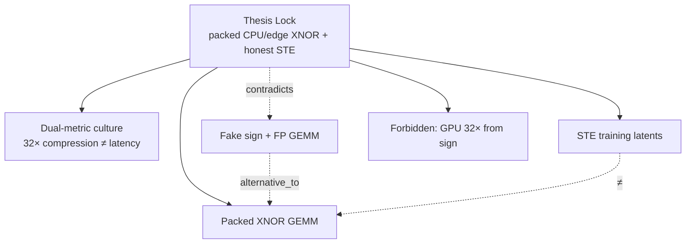
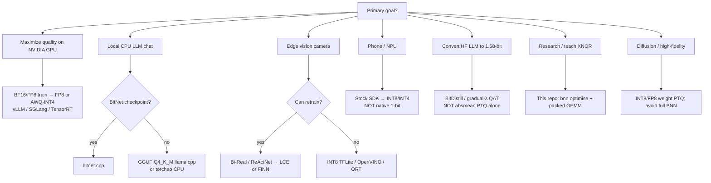
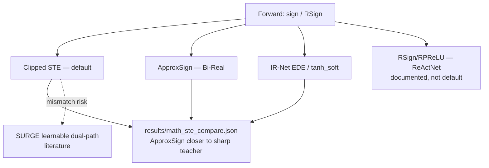
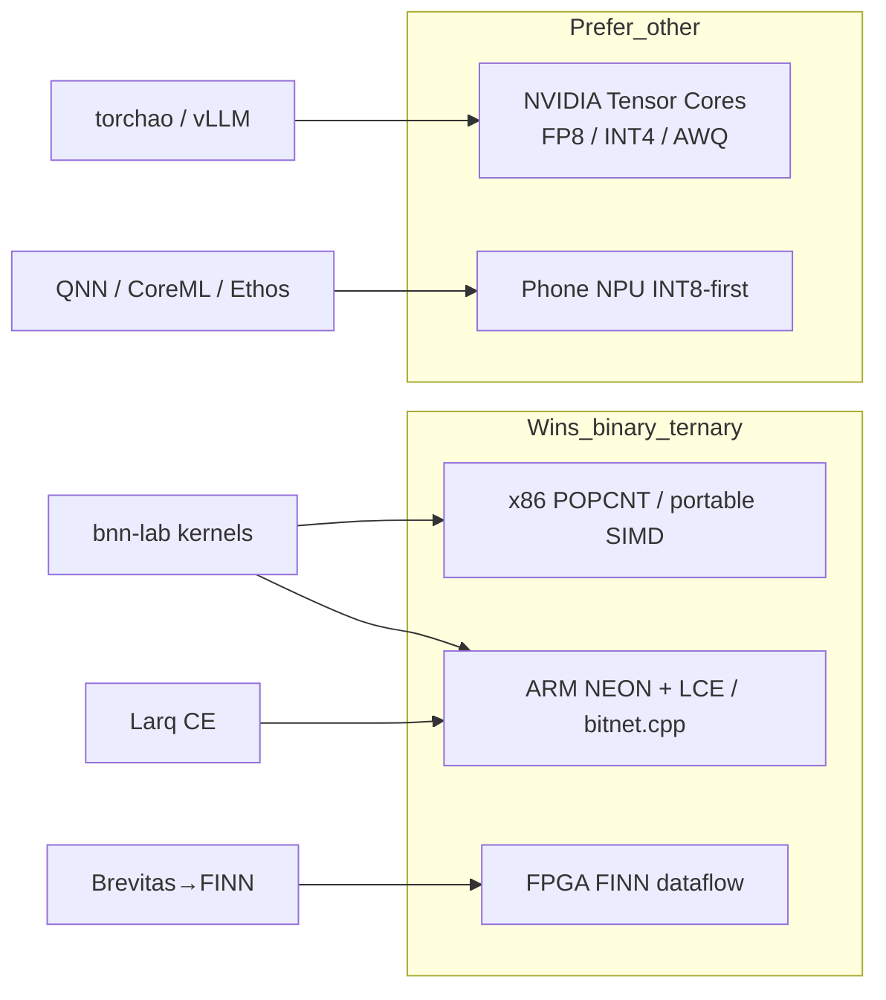
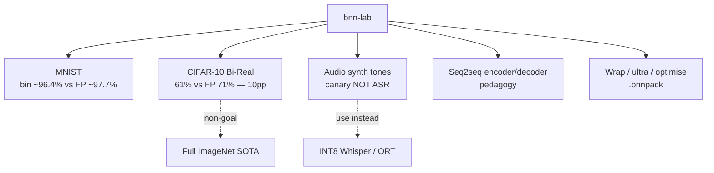
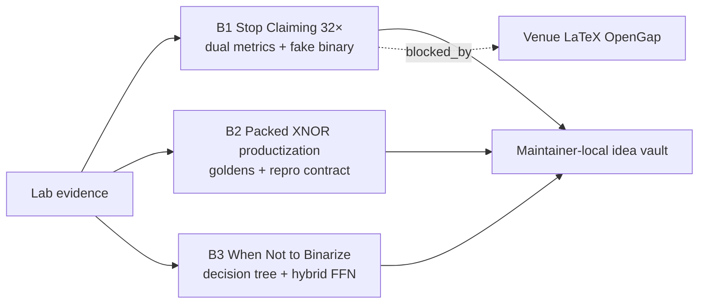
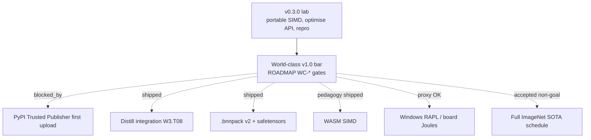

# BNN Knowledge Graph — Human View

Navigation companion to [`bnn_kg.json`](bnn_kg.json). Diagrams are Mermaid; numbers
come from committed `results/*.json` and cited papers — not invented.

---

## 1. Thesis map



---

## 2. Speedup accounting (op-count vs wall-clock)

```mermaid
flowchart LR
  subgraph Theory
    C32[Weight compression 32× exact]
    W64[~64× word-op reduction]
  end
  subgraph Measured
    SC[S_compute prepacked kernel]
    SE[S_e2e whole forward]
    AM[Amdahl S_e2e = 1/((1-f)+f/Sk)]
  end
  C32 -.->|do not claim as| SE
  W64 -.->|contradicts| SE
  SC --> AM --> SE
  FB2[Fake binary slower than torch FP<br/>benchmark.json ~1.4×] -.->|negative control| SC
```

**Lab anchors (CPU, committed):**

| Shape | S vs NumPy FP32 | Notes |
|-------|----------------:|-------|
| 128×2048×2048 | ~12× | err = 0 |
| 64×4096×4096 | ~24× | OpenMP thread curve recorded |
| 32×8192×8192 | ~29× | theory word red. still 64× |

Wrap demo e2e: FP ~34 ms → wrapped ~7 ms (**~4.82×**), compression still **32×**.

---

## 3. Wrap / deploy decision tree



---

## 4. Training / STE cluster



**Rule:** STE trains; packed kernels infer. Training throughput is not a BNN win.

---

## 5. Hardware map



---

## 5b. ImageNet 1-bit accuracy ladder (enrichment)

Canonical W1A1 top-1 ladder (literature — **not** lab goldens):


Node: `metric.imagenet.bnn_ladder`. Lab CIFAR Bi-Real (~61% vs FP ~71%) is a **canary**, not this ladder.

---

## 6. Modality map (lab canaries)



---

## 7. Novel paper candidates (local vault)



Idea-vault folders under `C:\00 Research Papers\` are **maintainer-local** — cite
[`docs/32_NOVEL_PAPER_CANDIDATES.md`](../docs/32_NOVEL_PAPER_CANDIDATES.md) in-repo.

---

## 8. Roadmap: v0.3.0 vs v1.0 leftovers



`gap_pypi_trusted` is the remaining human blocker. Distill, `.bnnpack` v2, WASM pedagogy, layer search, and bitnet.cpp pin are **merged / closed-by-policy** — do not re-open them from stale `open_pr` fields.

---

## 9. Contradiction cheatsheet

| Claim A | Claim B | Relation |
|---------|---------|----------|
| Compression **32×** | E2E latency **32×** | `contradicts` — report both |
| Theoretical **~64×** word ops | Measured `S_e2e` | `contradicts` — Amdahl |
| `sign()` simulation | Packed kernel speedup | `alternative_to` / fake binary |
| Absmean PTQ ternary LLM | BitDistill / CPT | `contradicts` quality path |
| Stock phone NPU 1-bit | Vendor INT8-first | `contradicts` drop-in hope |

---

## 10. Quick ID index (high-degree hubs)

| id | Why it matters |
|----|----------------|
| `thesis_lock` | Immutable north star |
| `dual_metric_culture` | How to report numbers |
| `algo_xnor_gemm` | Real speed path |
| `fake_binary_sign` | Negative control |
| `decision_wrap_tree` | Practitioner routing |
| `sys_recommend_stack` | `bnn recommend` CLI |
| `sys_eval_suite` | `bnn eval-suite` / fair shapes |
| `decision_wc_o_gates` | WC-O1–O4 (established on main) |
| `sys_kg` | Graph + CI integrity |
| `paper_bitnet_b158` | Ternary LLM era pivot |
| `paper_gptq` / `paper_bitdistiller` | INT4 distill disambiguation |
| `sys_repro_gates` | `bnn repro` / goldens |
| `paper_b1_honest_speedup` | Novel paper B1 |

---

## 11. CLI companions

```bash
bnn kg                  # counts + open gaps
bnn kg validate         # structural PASS/FAIL
bnn recommend --goal cpu-llm
bnn eval-suite --skip-pytest
```

See [`docs/44_KNOWLEDGE_GRAPH.md`](../docs/44_KNOWLEDGE_GRAPH.md) and [`docs/lanes/kg.md`](../docs/lanes/kg.md).
